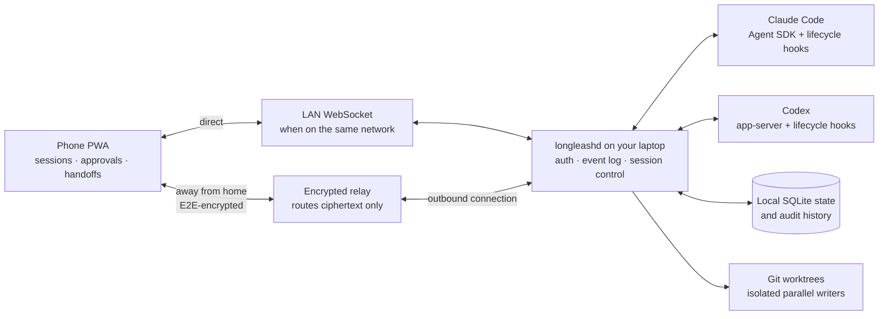
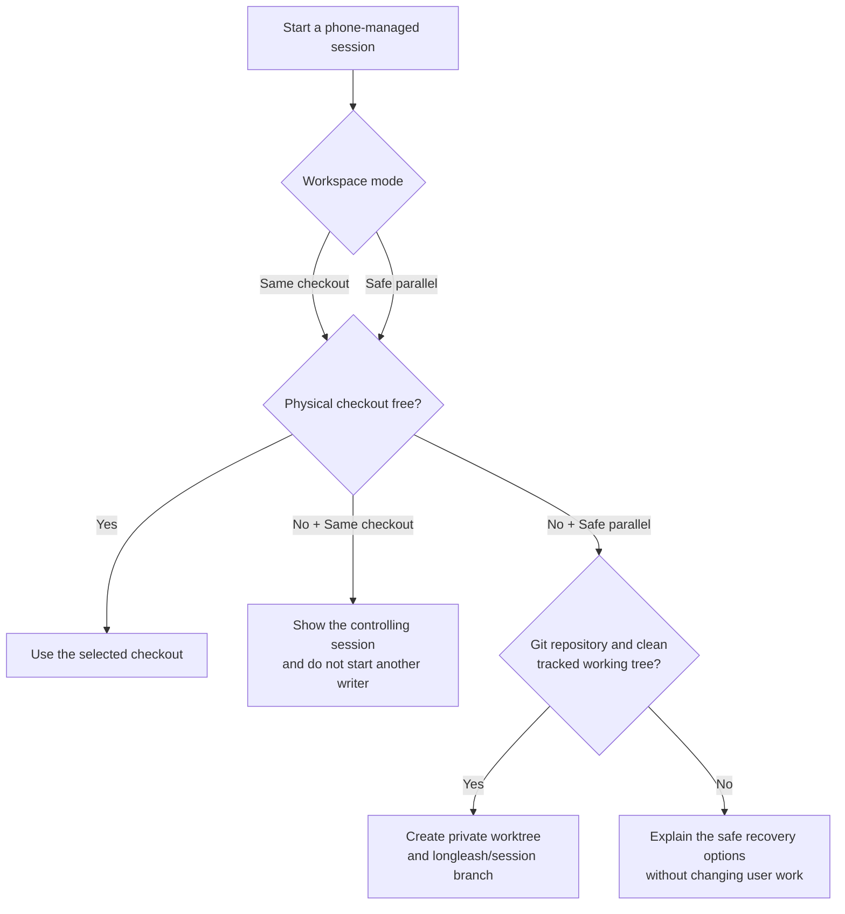

# LongLeash

**Keep Claude Code and Codex working on your laptop while you review, steer, approve, and hand off
their sessions from your phone.**

LongLeash is a local-first, open-source control plane for developer agents. Your laptop runs the
agents and remains the source of truth. The installable phone web app reconnects to it directly on
your LAN or through an end-to-end encrypted relay when you are away.

> [!IMPORTANT]
> LongLeash is in active dogfood/pre-release. The automated suite is extensive, but every release
> still requires the [real-device acceptance checklist](docs/ACCEPTANCE.md). Do not treat it as an
> unattended production service until you have tested your own laptop, agents, network, and phone.

## What works today

| Capability | Claude Code | Codex |
| --- | :---: | :---: |
| Start a managed session from the phone | Yes | Yes |
| See sessions started in Terminal or VS Code | Yes | Yes, with Codex CLI 0.147.0+ |
| Stream conversation and activity to the phone | Yes | Yes |
| Approve, deny, answer, steer, and stop | Yes | Yes |
| Continue a provider session from a terminal | Yes | Yes |
| Open its workspace in VS Code and resume through the CLI | Yes | Yes |
| Choose or change model and reasoning controls for new, delegated, or existing sessions | Yes | Yes |
| Configure thinking mode | Yes | Through reasoning effort |
| Delegate a reviewed briefing to the other agent and review its return | Yes | Yes |
| Safely start another phone-managed writer in the same Git project | Yes | Yes |

The important distinction is between **observing an existing provider process** and **moving its
conversation**. LongLeash can approve and observe a supported Terminal/VS Code session through
provider hooks. Sending a new phone message to that externally owned session is an explicit
takeover: LongLeash closes the original process, verifies it exited, and only then resumes the
conversation as a managed session.

## How it fits together



The relay serves the web app and transports sealed frames. It has no agent credentials, device
tokens, transcripts, project paths, or decryption keys. Your laptop does not need a public port.
See [Architecture](docs/ARCHITECTURE.md) for the implementation and trust boundaries.

## Install in five minutes

### Requirements

- macOS or Linux
- Node.js 22 or newer
- Git
- Claude Code and/or Codex already installed and authenticated with the provider
- Codex CLI 0.147.0 or newer if you want Terminal/VS Code session discovery
- A laptop that remains awake and online while you are away

LongLeash itself needs no account and no API key. It does not supply access to Claude or Codex;
the agent CLIs continue to use your existing provider login and plan.

### 1. Install

```sh
curl -fsSL https://raw.githubusercontent.com/Sahith59/LongLe-sh/main/scripts/install.sh | bash
```

The installer does not use `sudo`. By default it writes the checkout to `~/.longleash-app`, the
command to `~/.local/bin/longleash`, and local state to `~/.longleash`. It backs up provider config
before installing lifecycle hooks.

### 2. Start the laptop daemon

```sh
longleash
```

To limit remote starts to specific folders, name them explicitly:

```sh
longleash ~/code ~/work/client-project
```

Keep that terminal open. Press `q`, then Enter, for a clean shutdown.

### 3. Pair the phone

1. Scan the fresh QR printed by the laptop.
2. On first use, open the link and add LongLeash to the phone's home screen.
3. For later pairings, scan from **inside the installed LongLeash app** so the paired credentials
   belong to that app rather than a separate browser tab. Pasting the complete link also works.
4. Confirm the header says `linked · relay` or `linked · direct`.

Pairing links are single-use and expire. Press `n`, then Enter, in the daemon terminal whenever you
need a fresh one. Do not reuse a QR from a screenshot or share it—it contains a temporary secret.
If the installed app's camera stays soft, fit the full white border in the finder, tap **Refocus**,
then try **Switch lens** if it is offered. See [camera and QR recovery](docs/TROUBLESHOOTING.md#the-in-app-camera-is-soft-or-the-qr-will-not-scan).

### 4. Verify before trusting it

```sh
longleash doctor
```

The daemon must be reachable, laptop/daemon/relay builds must match, and each installed agent must
say `hook installed for this build`. If any line disagrees, follow the exact fix it prints or open
the [troubleshooting guide](docs/TROUBLESHOOTING.md).

## Daily use

### Start an agent from the phone

1. Tap **New session**.
2. Choose Claude or Codex.
3. Search for a folder inside the roots you allowed when starting LongLeash.
4. Write the task.
5. Keep **Safe parallel** selected unless you specifically require the physical checkout.
6. Optionally expand **Model & reasoning**.

LongLeash waits for a daemon acknowledgement before closing the sheet. If the checkout is already
owned, Safe parallel creates a private Git worktree and `longleash/<session>` branch. It never
auto-commits, merges, pushes, or deletes the result. Read [Session portability and safe parallel
work](docs/SESSION-PORTABILITY.md) before using concurrent writers.

### Change model or reasoning during a conversation

Open any Claude or Codex session and tap **Tune**. LongLeash shows the settings that are currently
pinned to that conversation:

- a live LongLeash-managed session applies the change to the **next response**; an in-progress
  response finishes unchanged;
- a dormant session saves the controls for its **next continuation**;
- a live Terminal/VS Code session remains owned by that provider process until you explicitly
  confirm **Move control to LongLeash**. LongLeash then verifies the old process ended, preserves
  the native conversation ID, and applies the controls when you next reply from the phone.

Returning every field to **Provider default** clears LongLeash's overrides. Approval, sandbox, and
one-writer workspace safety cannot be weakened from this panel.

### Control a session started on the laptop

Start Claude or Codex normally in Terminal or VS Code. A current lifecycle hook makes it appear on
the phone with two separate labels:

- provider: `Claude` or `Codex`;
- origin: `in a terminal`, `in VS Code`, or `from your phone`.

Approvals and questions can be answered from the phone without moving the conversation. Sending a
new message from the phone requires the explicit **End there & continue here** confirmation.

### Move back to the laptop

Open the session's handoff panel and choose:

- **Terminal** to copy the provider's exact resume command;
- **VS Code workspace** to open the project before resuming. Claude also receives `--ide`; Codex
  resumes in the terminal where the command is run.

Release a live writer before executing the copied command. Running two writers against one native
conversation can produce the provider's “active writer” error.

LongLeash never injects into another extension's private chat webview. Claude now exposes an
official exact-session VS Code URI; the planned companion will use it after verifying the workspace
and native session ID. Codex exposes app-server for rich clients but no documented external
exact-thread entry point into its own panel, so the companion will open the exact thread in a
LongLeash-owned VS Code editor. Until that ships, the current handoff remains the honest CLI/IDE
route. See [the VS Code companion plan](docs/VSCODE-EXTENSION.md).

### Delegate between agents

**Delegate** creates a bounded child session rather than allowing agents to message each other
without supervision:

1. choose a transcript message or session;
2. choose Claude or Codex, a role, and optional child model/reasoning controls;
3. review and edit the generated briefing;
4. start the child as an ordinary, independently controlled session;
5. review and edit its return before sending it to the parent.

Claude→Claude, Claude→Codex, Codex→Claude, and Codex→Codex are implemented. Delegated children
currently use reviewed sequential workspace transfer; isolated parallel delegation and merge UX
remain roadmap work. See [Delegate: design, safety invariants, and progress](docs/DELEGATION.md).

## Safe parallel sessions



“Same project” does not mean “same physical files.” Two mutating agents in one checkout can
overwrite each other between reads and writes. LongLeash therefore keeps one writer per checkout
and obtains concurrency through separate Git worktrees. Non-Git folders remain sequential.

## Command reference

| Command | Purpose |
| --- | --- |
| `longleash [folders…]` | Start the daemon and allowlist the named roots |
| `longleash doctor` | Diagnose daemon reachability, build identity, relay, and hooks |
| `longleash devices` | List phones paired with this laptop |
| `longleash revoke <id>` | Immediately revoke one paired device |
| `longleash revoke --all` | Revoke every device and start pairing again |
| `longleash update` | Pull code, install dependencies, rebuild the app, and reapply hooks |
| `longleash hooks` | Install or repair Claude/Codex lifecycle hooks |
| `longleash hooks --remove` | Remove LongLeash hooks from both providers |
| `longleash where` | Print the checkout used by the installed command |
| `longleash release` | Maintainer command: test, build, stamp, and deploy the phone app/relay |

While the daemon is running: `n` + Enter prints a new pairing QR, `r` + Enter revokes all devices,
and `q` + Enter exits cleanly.

## Updating

```sh
longleash update
```

Then stop the running daemon with `q` + Enter or Ctrl-C and start `longleash` again. A process that
was already running keeps the old code in memory. On the phone, tap the offered **Update** or pull
down to refresh, then rerun `longleash doctor` and require all builds to match.

The phone loads its app shell from the relay. Updating only the laptop checkout does not publish a
new phone UI. Maintainers and self-hosters should follow [Deploying the relay](docs/DEPLOY.md); the
guarded `longleash release` command refuses dirty or mismatched releases.

## Troubleshooting in sixty seconds

Before restarting anything, preserve the evidence:

```sh
longleash doctor
tail -n 150 ~/.longleash/daemon.log
```

| Symptom | First action |
| --- | --- |
| Pairing says the laptop did not answer | Keep the daemon running and press `n` + Enter for a new single-use QR |
| `LongLeash is already running` | Use the existing daemon; do not start a second copy |
| Phone shows an old UI or build mismatch | `longleash update`, restart the daemon, then update/refresh the phone app |
| Terminal/VS Code session is missing | Run `longleash doctor`, repair hooks, then start a fresh provider session |
| Checkout is already controlled | Open/stop the named session or launch with **Safe parallel** |
| Handoff says “Preparing…” | Wait for the provider's native conversation ID; verify hooks if it never arrives |
| Resume reports an active writer | Release or stop the old process before running the resume command |
| Stop/takeover fails | Do not repeatedly retry; capture doctor/log output and verify the original process really exited |
| Delegate says `not started` | Read the named safety gate; no child was created and the source kept control, so correct it and retry |
| Another session owns the checkout | Use the refusal receipt to open/stop the named provider, surface, path, and session; nothing was sent |
| Notification opens the wrong place | Update both daemon and phone app, then test a newly created approval |

The complete guide covers pairing, connection refusal, stale sessions/approvals, hook review,
worktrees, handoffs, VS Code exit messages, notifications, and safe bug reports:
**[Troubleshooting LongLeash](docs/TROUBLESHOOTING.md)**.

## Security and privacy boundaries

- The phone uses a typed protocol. There is no generic remote-shell or arbitrary-exec endpoint.
- Pairing creates per-device credentials; server-side tokens are stored hashed and are revocable.
- Relay traffic is end-to-end encrypted; the relay sees routing metadata and traffic timing, not
  content.
- Push payloads contain identifiers, never prompts, code, paths, or approval details.
- Remote starts are restricted to realpath-checked allowlisted roots.
- A phone cannot silently approve on behalf of another agent or another delegation.
- LongLeash does not weaken FileVault, the firewall, Gatekeeper, SIP, or provider hook review.
- The laptop is trusted and powerful by design. If the laptop or provider account is compromised,
  LongLeash cannot repair that trust boundary.

Read [Requirements and security posture](docs/REQUIREMENTS.md) and the [Architecture security
model](docs/ARCHITECTURE.md#security-model).

## Honest limits

- The laptop must remain awake, powered, online, and running `longleash`.
- iPhone web push requires the PWA to be added to the home screen; notification actions may open
  the app instead of completing directly from the lock screen.
- Lifecycle hooks observe supported agent events, not arbitrary terminal pixels. LongLeash is not
  a general terminal emulator and never scrapes a TUI.
- Vendor hooks can change. `longleash doctor`, contract tests, and explicit minimum versions reduce
  this risk but cannot eliminate it.
- Provider models and features still depend on the account and CLI installed on the laptop. A
  custom model ID can be rejected by the provider.
- Safe parallel is available only for Git projects with a clean tracked working tree. Worktrees are
  preserved for inspection; merge and cleanup are intentionally manual today.
- Native VS Code chat-panel injection is not supported.
- Delegate is implementation-complete through reviewed sequential returns, but physical-device
  cross-provider dogfood remains a release gate.

## Documentation

| Document | Use it when… |
| --- | --- |
| [Troubleshooting](docs/TROUBLESHOOTING.md) | Something failed and you want symptom-driven recovery steps |
| [Requirements](docs/REQUIREMENTS.md) | Preparing a laptop or reviewing security/reliability choices |
| [Session portability](docs/SESSION-PORTABILITY.md) | Running parallel sessions or moving work between phone, Terminal, and VS Code |
| [Architecture](docs/ARCHITECTURE.md) | Understanding components, data flow, storage, and trust boundaries |
| [Deploying the relay](docs/DEPLOY.md) | Self-hosting or publishing a new phone app build |
| [Phase 1 phone test](docs/PHASE1-PHONE-TEST.md) | Running the short practical fixes + Delegate Phase 1 check |
| [Release acceptance](docs/ACCEPTANCE.md) | Performing the mandatory complete laptop + real-phone release gate |
| [Delegate plan](docs/DELEGATION.md) | Understanding cross-agent handoffs, guarantees, and remaining phases |
| [VS Code companion plan](docs/VSCODE-EXTENSION.md) | Understanding the exact-session IDE design, phases, boundaries, and release gates |
| [Product plan](PLAN.md) | Reading the historical phase plan, current corrections, and known platform walls |
| [Decision log](context/DECISIONS.md) | Understanding why major product and security choices were made |
| [Glossary](context/GLOSSARY.md) | Translating LongLeash terminology into plain language |

Research reports and historical architecture evaluations live under [agents/](agents/README.md).
They are evidence and project history, not current user instructions.

## Development

```sh
pnpm install
pnpm test
pnpm typecheck
pnpm build
```

The regular suite uses deterministic adapters and failure-mode tests. Live provider contracts are
separate because they consume real provider sessions:

```sh
pnpm --filter @longleash/daemon test:contract
```

Automated tests are necessary but not sufficient. Before releasing, complete
[docs/ACCEPTANCE.md](docs/ACCEPTANCE.md) on a real laptop and phone.

## Uninstall

First remove provider hooks:

```sh
longleash hooks --remove
```

Then remove `~/.longleash-app` and `~/.local/bin/longleash`. The directory `~/.longleash` contains
paired-device records, session metadata, audit data, and preserved worktrees; back up anything you
need before deleting it.

## License

MIT — see [LICENSE](LICENSE).
