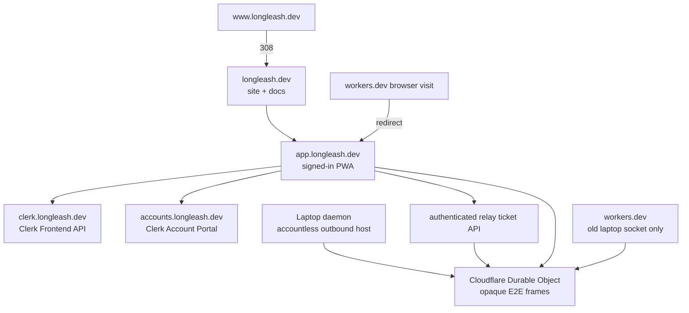

# Account-enabled public launch runbook

This is the owner checklist for the first public release at `longleash.dev`. It deliberately keeps
secret-bearing dashboard work with the owner and code/test/deployment work in the repository.

## Final topology



Cloudflare remains registrar, DNS/TLS provider, static host, Worker, rate limiter, and relay. Clerk
provides account/session management. Google proves identity. The laptop still runs the agents and
stores provider credentials, repositories, transcripts, audit history, pairing secrets, and frame keys.

## 1. Lock the domain and owner accounts

Complete these in the Cloudflare dashboard:

- turn **Auto renew** on for `longleash.dev`;
- enable MFA for the Cloudflare owner account and save recovery codes offline;
- enable Registrar Lock and DNSSEC;
- verify the registrant contact email and keep it current;
- add a second recovery administrator only if it is a separately secured person/account.

Do not share an API token, recovery code, password, card, OAuth secret, or screenshot containing one.

## 2. Make the public contact addresses real

Use Cloudflare Email Routing to forward these aliases to an inbox you actively monitor:

- `support@longleash.dev` — setup and ordinary product questions;
- `security@longleash.dev` — private vulnerability reports;
- `privacy@longleash.dev` — access, correction, export, and deletion requests.

Send a message to each alias from a different provider and reply once. Public promotion is blocked
until all three deliver. Do not route security reports into a public issue tracker.

## 3. Create the Clerk production application

1. Create a project-owned Clerk account, enable MFA, and store recovery codes offline.
2. Create an application named **LongLeash**. Keep a development instance for setup tests and create
   a separate production instance for launch.
3. Enable Google as the only production sign-in method for this release. Do not enable passwords,
   phone/SMS, organizations, or extra social providers merely because they are available.
4. Configure the production root domain as `longleash.dev`. Clerk provisions the Frontend API at
   `clerk.longleash.dev` and the Account Portal at `accounts.longleash.dev`.
5. Add the DNS records Clerk displays. Cloudflare may need those exact records set to **DNS only**;
   follow Clerk's live domain-verification instructions rather than guessing.
6. Restrict Clerk's subdomain allowlist to `app.longleash.dev`. Do not allow `*.longleash.dev`.
7. Allow redirect/return URLs only below `https://app.longleash.dev/`.
8. Disable any optional telemetry or user fields the product does not use, where the plan permits.

The Worker separately verifies Clerk session tokens with
`authorizedParties: ['https://app.longleash.dev']`. This is not optional: it prevents a compromised
sibling subdomain from presenting a session as though it came from the app.

## 4. Configure Google OAuth without broad scopes

In a project-owned Google Cloud project:

1. Configure the OAuth consent/branding screen for an external production app named **LongLeash**.
2. Set:
   - homepage: `https://longleash.dev`;
   - privacy: `https://longleash.dev/privacy`;
   - terms: `https://longleash.dev/terms`;
   - authorized JavaScript origins: `https://longleash.dev`, `https://www.longleash.dev`, and
     `https://app.longleash.dev`.
3. Copy the **exact production redirect URI shown by Clerk** into Google. For the current production
   instance it is `https://clerk.longleash.dev/v1/oauth_callback`; do not construct or shorten it.
4. Request only `openid`, `email`, and `profile`. Never request Gmail, Drive, Contacts, Calendar,
   GitHub, source repository, or provider scopes.
5. Put the Google Client ID and Client Secret directly into Clerk's production dashboard. Do not
   paste either into chat or commit them; while a Client ID is not a password, it still belongs in
   the controlled configuration path.
6. Move the consent screen out of testing only after the domain, privacy, terms, support, and
   authorized redirects are correct.

## 5. Set Worker configuration without exposing secrets

Run these from the repository on the owner's laptop. Wrangler prompts securely; do not put values on
the command line because shell history is durable.

```sh
pnpm --dir packages/relay exec wrangler secret put CLERK_PUBLISHABLE_KEY
pnpm --dir packages/relay exec wrangler secret put CLERK_SECRET_KEY
openssl rand -base64 48 | pnpm --dir packages/relay exec wrangler secret put RELAY_TICKET_SECRET
```

The Clerk values are from the **production** instance (`pk_live_…` and `sk_live_…`). The generated
relay secret must never be reused elsewhere. Confirm only the secret names—not their values—with:

```sh
pnpm --dir packages/relay exec wrangler secret list
```

## 6. Pre-deploy gates

The maintainer runs:

```sh
pnpm typecheck
pnpm test
pnpm build
pnpm --dir packages/relay exec wrangler deploy --dry-run
```

The release remains blocked if the working tree has unrelated changes, contact aliases do not work,
Clerk/Google production verification is incomplete, or the canonical app returns `ready: false` from
`/api/auth/config`.

## 7. Post-deploy HTTP and account checks

```sh
curl -fsS https://longleash.dev/
curl -fsSI https://www.longleash.dev/
curl -fsS https://app.longleash.dev/health
curl -fsS https://app.longleash.dev/api/auth/config
curl -fsS https://app.longleash.dev/build.json
```

Require the `www` response to redirect permanently to the apex, health to identify the relay, auth
config to say `required: true` and `ready: true`, and every host to use a valid certificate.

Then run the physical iPhone matrix:

1. Open the app signed out; no paired session may be visible.
2. Continue with Google; return to the exact app URL.
3. Scan a fresh QR; the fragment must survive OAuth and pair only once.
4. Complete one harmless approval over Wi-Fi, then over cellular.
5. Sign out; the session disappears. Sign in as a second Google user; the first user's device must
   remain invisible and require a fresh QR.
6. Return to the first account; its own paired credential may reappear.
7. Download account data and inspect that it contains no path, prompt, transcript, token, or key.
8. Delete a disposable test account; it must no longer sign in, and its browser credentials must be gone.
9. Confirm LAN/self-hosted mode still opens without Clerk.
10. Run `longleash doctor` and require matching app, daemon, relay, and installed builds.

Preserve the previous Worker version until this matrix passes. A deployed build is not a public
release merely because HTTP 200 works.

## 8. Owner/legal facts still required

Before paid checkout or broad commercial promotion, have qualified counsel review the Terms and
Privacy Notice for the operator's actual country/state, business name/entity, service address,
consumer cancellation rules, age threshold, limitation language, and tax obligations. Do not put a
home address in the repository; use a legitimate business mailing address or registered agent where
law permits.
