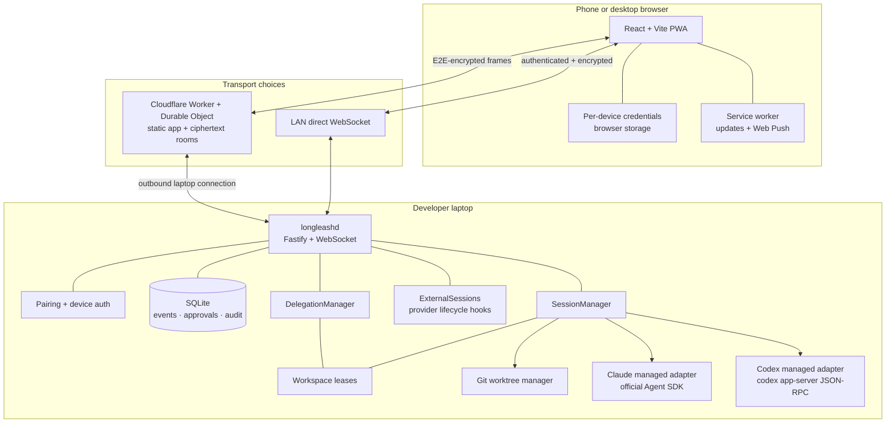
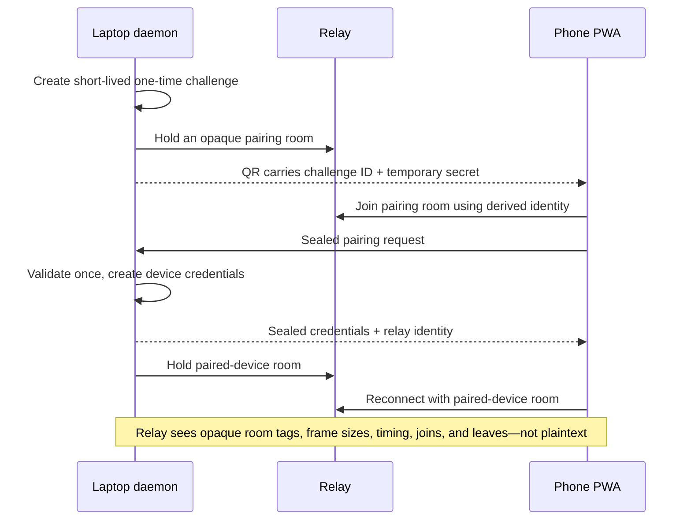
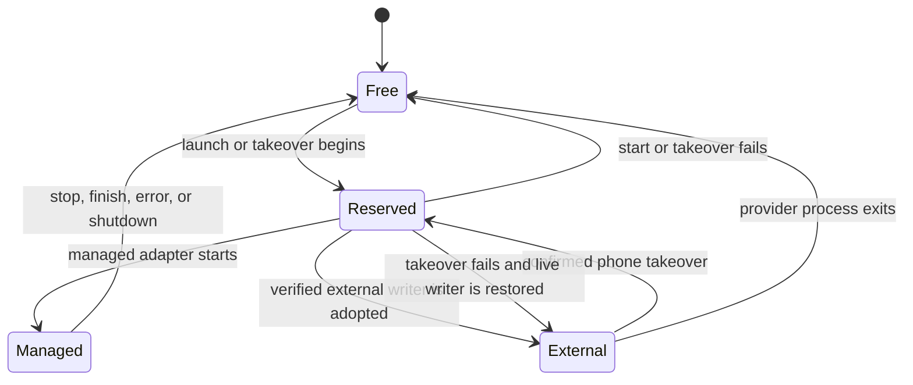
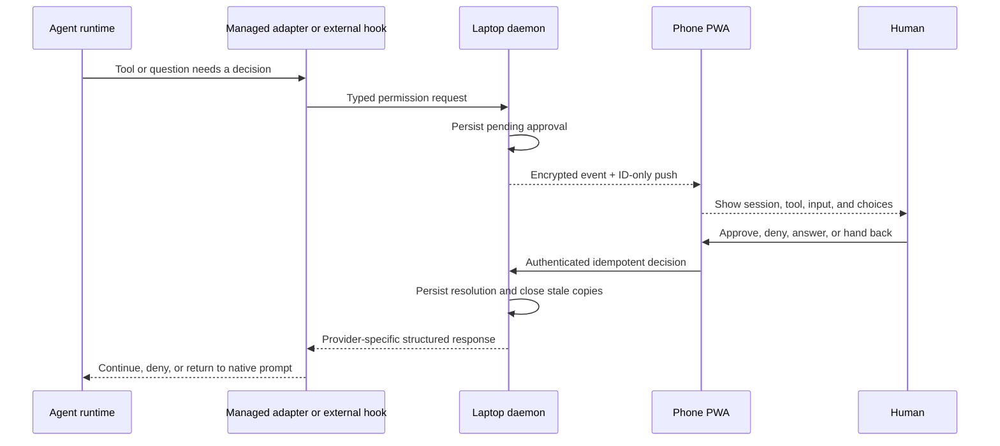

# LongLeash architecture

LongLeash keeps authority on the developer's laptop. The phone is a reconnecting control surface;
the relay is an untrusted ciphertext router; Claude Code and Codex remain the agent runtimes.

This document describes the implementation that exists now. Planned work belongs in
[PLAN.md](../PLAN.md) or the [Delegate roadmap](DELEGATION.md), not in the current architecture.

## System map

The HTTPS relay origin is the dependable anywhere URL and serves the current PWA bundle. LAN mode
is an optional shorter path when browser and network policy permit it. Both paths carry the same
typed protocol; neither gives the phone a generic shell.

## Current components

| Component | Implementation | Responsibility |
| --- | --- | --- |
| Phone app | React 19, Vite, TypeScript PWA | Pairing, session list/detail, approvals, questions, messages, Stop, Delegate, handoffs, device/update diagnostics |
| Laptop daemon | Node.js, TypeScript, Fastify, WebSocket | The only authority for auth, sessions, approvals, leases, audit, relay connection, and local files |
| Durable state | SQLite via `better-sqlite3`, WAL | Cursor-addressed events, resumable session metadata, approvals, devices, delegation records, and workspace claims |
| Protocol | Zod-validated messages | Rejects malformed operations and makes capability/version changes explicit |
| Managed Claude | Official Claude Agent SDK | Structured streaming, tool permission callbacks, questions, Stop, and native resume IDs |
| Managed Codex | `codex app-server` JSON-RPC | Structured threads, turns, streaming items, approvals, Stop, and native resume IDs |
| External session discovery | Claude/Codex lifecycle hooks plus provider transcript formats | Observes supported Terminal/VS Code sessions without scraping terminal pixels or chat webviews |
| Relay | Cloudflare Worker and one Durable Object per room | Serves static PWA assets and moves ciphertext between one daemon and paired devices |
| Notifications | Web Push | Wakes a phone with identifiers only; the app fetches current content after reconnecting |
| Parallel workspace provider | Git worktrees and per-session branches | Gives multiple managed writers isolated files while preserving one writer per physical checkout |
| Delegation | `DelegationManager` above `SessionManager` | Builds reviewed briefings/returns and enforces parent/child attribution, idempotency, depth, and workspace transfer |

## Pairing and connection

Challenges are ephemeral and single-use. The daemon stores device tokens as hashes and can revoke
one device or all devices. Revocation also drops live connections.

On the LAN, pairing and normal traffic can travel directly. With a relay configured, the QR points
at the HTTPS relay-served app so one installed address continues working away from home.

## Session ownership model

Every writable process claims one canonical realpath checkout. Ownership is durable because daemon
restarts and external provider processes do not occur in a neat order.

The daemon never equates “a signal was sent” with “the process exited.” An external takeover
reserves the checkout, signals the verified provider process, waits for exit, and only then resumes
the native conversation as managed. Failure restores the live owner or releases the reservation.

For a second ordinary phone-managed session in the same Git project, `workspaceMode: auto` creates
an isolated worktree when the physical checkout is occupied. Dirty tracked changes cause a clear
refusal; non-ignored untracked files are copied as untracked files; ignored dependencies are not
duplicated. Worktrees remain after a session ends until the person reviews them.

## Approval flow

Unanswered approvals expire safely instead of hanging forever. Repeated decisions are idempotent.
Pending approvals are reconciled when sessions end or the daemon restarts so historical state
cannot masquerade as live authority.

Provider settings may pre-approve some actions before an external hook is consulted. LongLeash
cannot retroactively gate those actions; it records observable activity and reports the weakened
posture. See [Requirements](REQUIREMENTS.md#one-honest-caveat-about-approvals).

## Conversation portability

A LongLeash session stores its own durable ID and, when available, the provider's native Claude or
Codex conversation ID. Native IDs produce copyable resume commands for every origin.

- Terminal handoff resumes in the selected project directory.
- VS Code workspace handoff opens the project first. Claude uses `--ide`; Codex resumes in the
  invoking terminal.
- A live writer must be released before its resume command is executed.
- LongLeash does not and cannot inject a transcript into a sealed vendor VS Code chat webview.

See [Session portability](SESSION-PORTABILITY.md) for the user-facing behavior and limits.

## Reconnect and replay

The phone is designed as if it is always about to disconnect:

1. durable events receive a per-session monotonic sequence;
2. the client records the last cursor it applied;
3. reconnect subscribes from that cursor;
4. the daemon replays durable events before live tailing;
5. an unrecoverable gap is explicit rather than silently dropping output;
6. `live` process state is separate from conversational status, so old replay cannot resurrect a
   dead Stop button or stale approval.

Backpressure is bounded. A slow client receives a resync requirement instead of causing unbounded
daemon memory growth.

## Security model

### Trusted

- the developer's laptop and operating-system account;
- the locally running daemon and its data directory;
- the provider CLIs/accounts the developer chose to install;
- a paired phone while it remains in the developer's control.

### Not trusted with plaintext

- the hosted/self-hosted relay;
- push infrastructure;
- networks between the phone and laptop.

### Enforced invariants

1. **Typed operations only.** No generic remote `exec`, terminal byte stream, or arbitrary process
   control API exists.
2. **Allowlisted roots.** Session starts resolve symlinks/realpaths and cannot escape the roots the
   laptop owner named.
3. **Per-device revocation.** Random device credentials are hashed at rest and compared safely.
4. **End-to-end encrypted relay frames.** The relay has neither content keys nor agent credentials.
5. **ID-only pushes.** Notification services receive no transcript, command, approval, or path.
6. **One writer per checkout.** Concurrency requires filesystem isolation, not optimistic prompting.
7. **Human-owned delegation.** An agent cannot grant permission, claim consent, or silently deliver
   another agent's briefing/return.
8. **Audited mutations.** Decisions, session lifecycle changes, delegation, device changes, and
   ownership transfers are recorded locally.

### Honest limits

- A compromised trusted laptop has the same access as its logged-in user; encryption in transit
  cannot fix endpoint compromise.
- The relay can observe traffic timing, size, room joins, and availability.
- Provider hook and transcript contracts can change across CLI releases.
- Web Push delivery and background execution are controlled by phone/browser policy.
- A sleeping, powered-off, rebooted-at-FileVault, or disconnected laptop cannot answer.

## Local files and operational state

Default installed locations:

| Path | Contents |
| --- | --- |
| `~/.longleash-app` | Installed Git checkout and built PWA |
| `~/.local/bin/longleash` | Small launcher pointing at the installed checkout |
| `~/.longleash` | Databases, daemon logs, hook endpoint, relay config, push keys, and preserved worktrees |
| `~/.claude/settings.json` | Claude lifecycle hook registration, backed up before first edit |
| `${CODEX_HOME:-~/.codex}/config.toml` | Codex lifecycle hook registration, backed up before first edit |

Do not publish the data directory or provider configuration. Use `longleash devices` and
`longleash revoke` instead of manually editing auth records.

## Deliberate non-features

- No TUI or VS Code chat-webview scraping.
- No generic remote shell.
- No automatic commits, merges, pushes, worktree deletion, or conflict resolution.
- No hidden autonomous agent-to-agent loop.
- No attempt to bypass provider hook review or operating-system security.
- No claim that an automated suite replaces the [real-device acceptance gate](ACCEPTANCE.md).
