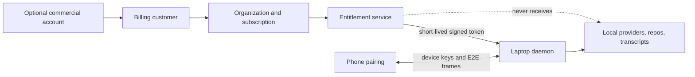
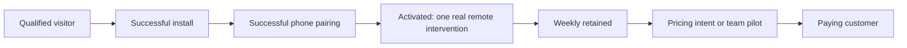

# LongLeash monetization plan

**Decision date:** 2026-08-15  
**Status:** commercial source of truth; hypotheses remain gated by external usage and interviews  
**Engineering checkpoint:** this plan does not advance Phase 2A. Resume engineering from
[`PHASE2A-CHECKPOINT.md`](PHASE2A-CHECKPOINT.md).

LongLeash has a credible problem and a plausible business, but neither revenue nor product-market
fit has been proved. The project has no meaningful external adoption baseline yet. **$5,000 MRR is
a target, not a result that engineering can guarantee.** This document turns that target into
measurable customer, product, and reliability gates.

## Executive decision

1. Keep the local product and self-hosting path complete, accountless, and free.
2. Keep the public hosted relay free during a measured preview. Do not publish permanent `$7`
   pricing yet.
3. Eventually charge for two operated products:
   - **Personal Cloud:** managed remote connectivity, push delivery, device recovery, and support.
   - **Team Control:** governed multi-agent coordination, shared audit, roles, policies, and support.
4. Add login only to the optional commercial control plane. Pairing and local/self-hosted use must
   never require an account.
5. Validate teams through founder-led design partnerships. Reddit can seed awareness, but it is not
   a complete acquisition strategy.
6. Treat the first pricing numbers below as testable offers, not promises engraved in the UI.

## What changed from the 2026-08-09 thesis

The earlier plan correctly protected the complete free/self-hosted path and proposed charging for
infrastructure we operate. Its `$7/month hosted relay` conclusion is now too narrow.

Since that research, the category has moved quickly:

- Anthropic's official Remote Control connects Claude Code running locally to Claude on web or
  mobile and is included with supported Claude plans. It also supports sessions started from VS
  Code. [Anthropic Remote Control documentation](https://code.claude.com/docs/en/remote-control)
- OpenAI's Codex Remote makes a phone a control plane for connected hosts and workspaces, including
  starting and steering work, approvals, worktrees, and review.
  [OpenAI: Mastering Codex Remote](https://developers.openai.com/blog/mastering-codex-remote-for-engineering)
- Happy is a free MIT-licensed Claude/Codex mobile and web client with more than 20,000 GitHub stars.
  [Happy repository](https://github.com/slopus/happy)
- Happier is a free MIT-licensed, self-hostable multi-provider client that advertises existing-
  session takeover, collaboration, subagents, worktrees, controls, and handoff.
  [Happier repository](https://github.com/happier-dev/happier)
- ClawTab sells a hosted relay for `$4.99/month`; Port22 advertises a `$19.99/year` founding tier;
  CouchCode and WhipDesk advertise substantial individual functionality for free.
  [ClawTab](https://clawtab.cc/), [Port22](https://www.tryport22.com/),
  [CouchCode](https://couchcode.io/), [WhipDesk](https://whipdesk.com/)

Therefore, generic phone access is an important acquisition feature, but it is not a durable paid
moat by itself. A competitor can copy it, and both agent vendors can bundle it.

### Competitive truth, without panic

| Competitor group | Where it is ahead today | Threat to LongLeash | LongLeash's credible response |
| --- | --- | --- | --- |
| **Anthropic Remote Control** | Native Claude integration, distribution, trust, and bundling | Very high if LongLeash is pitched as “Claude on your phone” | Cross-provider supervision, explicit ownership, reviewed handoff, and governance |
| **OpenAI Codex Remote** | Native Codex host/workspace control, review, worktrees, and mobile distribution | Very high if LongLeash is pitched as “Codex on your phone” | One control plane spanning providers and externally started Terminal/IDE sessions |
| **Happy** | Large open-source community and a simple free Claude/Codex remote experience | High for individual acquisition and mindshare | Reliability evidence, truthful session capabilities, safety, portability, and delegation |
| **Happier** | Closest broad open-source feature set; already advertises collaboration, takeover, providers, queues, and worktrees | Highest direct open-source product threat | Go deeper on governed agent-to-agent work, ownership, audit, and tested failure handling |
| **ClawTab / Port22** | Low-price managed connectivity anchors | Compresses the price of relay-only utility | Never sell “just a relay”; bundle operated reliability, recovery, support, and coordination |
| **CouchCode / WhipDesk** | Broad individual features offered free | Makes a feature checklist a weak reason to pay | Earn trust through product discipline and monetize operated/team outcomes |
| **Conductor** | Commercial maturity and willingness-to-pay evidence for professional parallel-agent workflow | Competes for serious multi-agent users and team budgets | Differentiate through local-first remote supervision, cross-provider reach, and governance |

No competitor is guaranteed to crush LongLeash, but several are ahead in distribution, maturity,
or breadth. LongLeash currently has no evidence of an adoption advantage: on 2026-08-15 its public
[repository](https://github.com/Sahith59/LongLe-sh) had zero stars, zero forks, and one open issue.
Its potential advantage is a coherent safety and coordination model; that advantage only becomes
real after external users retain and teams pay.

## The problem is real; willingness to pay is unproved

The 2025 Stack Overflow Developer Survey reports that 84% of respondents use or plan to use AI
tools, while users of agents commonly report productivity and time benefits. It also reports weak
team-collaboration gains and high concern about accuracy and security. That combination supports
LongLeash's trust-and-coordination direction, but it does not prove that developers will pay us.
[Stack Overflow 2025 AI survey](https://survey.stackoverflow.co/2025/ai)

Anthropic reports heavy recurring usage among Claude Code users and analyzed hundreds of thousands
of sessions. This is useful directional evidence that agent supervision is frequent enough to
matter, but it is vendor research and should not be treated as LongLeash demand.
[Anthropic: How developers use Claude Code](https://www.anthropic.com/research/claude-code-expertise)

The honest conclusion is:

> The market is large and the friction is visible. LongLeash still has to prove activation,
> retention, reliability, and willingness to pay with people who are not its creator.

## Positioning that can survive first-party competition

LongLeash should not lead with “Claude/Codex on your phone.” Lead with:

> **The local-first control plane for supervising coding agents across providers, terminals, and
> IDEs—with explicit workspace ownership, reviewed handoffs, and an audit trail.**

The defensible product system is the combination of:

- one view across Claude and Codex rather than a vendor-specific remote;
- observation and honest capability labels across LongLeash, Terminal, and VS Code sessions;
- exact conversation portability where provider contracts permit it;
- explicit single-writer ownership and isolated worktrees instead of silent checkout races;
- human-reviewed Claude↔Claude, Claude↔Codex, Codex↔Claude, and Codex↔Codex delegation;
- provider-aware model, reasoning, and approval controls;
- local credentials, repositories, transcripts, and tool data;
- operational evidence, diagnostics, audit, and support.

First-party clients will usually win their own single-provider happy path. LongLeash can win the
cross-provider, multi-session, safety, portability, and team-governance layer.

## Who pays

### Primary beachhead: multi-agent professionals

Senior engineers, consultants, founders, and AI-heavy developers who run more than one provider or
several sessions and are regularly blocked by approvals away from their laptop.

Their purchase trigger is not novelty. It is a reliable intervention, handoff, or delegation that
would otherwise waste meaningful time.

### Revenue engine: small engineering teams

Teams with 5–25 agent-heavy engineers have a larger and more defensible problem:

- who owns a checkout or worktree;
- what an agent changed and who approved it;
- how work moves between agents or people;
- whether policy was applied consistently;
- how a failure is diagnosed and audited.

Conductor currently charges `$50/month` for its individual Pro tier, which shows that professional
multi-agent workflow can support pricing far above low-cost relay utilities. Its product and target
are not identical to LongLeash, so this is an anchor—not validation of our price.
[Conductor pricing](https://www.conductor.build/pricing)

### Not a first target

- casual developers who run one agent occasionally;
- enterprises needing SSO, SCIM, procurement, SLAs, and compliance evidence we have not built;
- buyers looking for a hosted coding environment rather than a local control plane.

## Packaging hypothesis

Nothing in this table should be sold before its capability and release gate exists.

| Offer | Initial price hypothesis | What the customer receives | Release condition |
| --- | ---: | --- | --- |
| **Community** | `$0 forever` | Complete local/LAN and self-hosted product; providers, handoff, delegation, and local history are not crippled | Always available without an account |
| **Hosted Preview** | `$0` | Managed relay and push while reliability, cost, and demand are measured | Current public stage; fair-use and abuse protection may apply |
| **Founding Personal Cloud** | `$8/month` or `$80/year` | Managed connectivity/push, device recovery, release channel, diagnostics, and priority support | First 100 paying customers; price remains while subscription stays active |
| **Personal Cloud** | `$10/month` or `$100/year` | Same operated individual service at standard price | Only after preview gates and billing reliability pass |
| **Founding Team Pilot** | `$300/month/org`, up to 10 seats | White-glove onboarding plus the actually shipped shared control, roles, and audit features | First 10 design partners; do not sell before team product exists |
| **Team** | `$30/user/month`, 5-seat minimum, or `$300/user/year` | Governed multi-agent coordination, organization controls, shared audit, policies, and support | GA only after isolation/security/reliability gates pass |
| **Business/Enterprise** | Not priced | Future SSO/SCIM, administrative controls, support/SLA, and procurement | Do not advertise as available until built |

### Pricing rules

- The tracked repository—including the relay implementation—is already distributed under the root
  MIT license. Do not base the business on retroactively hiding it. The paid moat is the operated
  service, support, trust, reliability, and organization workflow.
- No lifetime deal: an operated relay and support create recurring cost and responsibility.
- No token markup: LongLeash does not sell model tokens.
- No session-count or concurrency tax in the MIT client: it is arbitrary, easy to bypass, and not
  tied to infrastructure value.
- No feature degradation in self-hosted Community merely to force conversion.
- Annual plans are discounted for commitment and lower payment overhead, not presented as fake
  urgency.
- A team minimum is acceptable because onboarding, support, and governance create organization-
  level cost. Do not disguise an individual plan as a team plan.

## The $5,000 MRR model

### Pure individual path

At `$10/month`, `$5,000 MRR` requires **500 paying individuals**.

- at 5% activated-free-to-paid conversion: 10,000 activated free users;
- at 3% conversion: approximately 16,667 activated free users.

Industry surveys are broad, but they keep this estimate grounded: ChartMogul reports 3–5% as a
good freemium conversion range and emphasizes the wide spread; Lenny's survey found a roughly 5%
median for developer-focused products. Neither predicts LongLeash's conversion.
[ChartMogul 2026 SaaS Conversion Report](https://chartmogul.com/reports/saas-conversion-report/),
[Lenny's Newsletter freemium benchmarks](https://www.lennysnewsletter.com/p/what-is-a-good-free-to-paid-conversion)

From zero measured external adoption, 500 paying individuals in a few months is possible only
with exceptional distribution. It is not a responsible base forecast.

### Pure team path

At `$30/seat/month`, `$5,000 MRR` requires 167 paid seats—approximately 17 ten-seat teams. This is
a smaller number of decisions than the individual path but needs a real team product, trust, and
founder-led sales.

### Recommended mixed path

| Customer group | Count | Price | Gross MRR |
| --- | ---: | ---: | ---: |
| Personal Cloud | 200 | `$10/month` | `$2,000` |
| Team | 10 organizations × 10 seats | `$30/seat/month` | `$3,000` |
| **Total** | | | **`$5,000`** |

This is the most credible target shape. It still requires repeatable acquisition and a team product
that does not exist today.

If a Merchant of Record charges 5% + 50¢ per transaction, that mix produces roughly `$4,645`
after payment-processing/MoR fees and before hosting, support, refunds, income tax, or any other
expense. If the actual goal is `$5,000` deposited before operating expenses rather than gross MRR,
target approximately `$5,500–$5,800` billed MRR. Annual cash collected up front is not monthly
recurring revenue; report annual contract value divided by twelve.

### Six-month attempt scenario—not a forecast

The clock starts only after public-preview Gate 0 passes. Later months move when their evidence gate
passes, not because the calendar says so.

| Month | Evidence goal | Commercial goal | Indicative gross MRR |
| --- | --- | --- | ---: |
| **1** | 10 observed testers; eliminate install/pair/intervention blockers | Conduct 10 interviews; collect no payment | `$0` |
| **2** | 100 activated users, 30 WAU, first D30 cohort forming | Secure 5 concrete payment commitments and 2 team prospects | `$0` |
| **3** | Retention/reliability gate passes | Open Founding Personal only if Gate 2 passes; onboard 3 unpaid team design partners | `$0–$400` |
| **4** | Team governance prototype used weekly | 50 founding personal customers plus 2 paid team pilots | about `$1,000` |
| **5** | Repeatable onboarding and a second acquisition channel | 100 personal customers plus 5 ten-seat teams | about `$2,300` |
| **6** | Churn, support, and incidents remain sustainable | 200 personal customers plus 10 ten-seat teams | `$5,000` |

This is an aggressive upside path. A responsible base expectation from today's zero-adoption
baseline is longer—often 6–12 months or more. Missing a monthly number does not justify lowering
security or shipping unbuilt team promises; it means revisit acquisition, activation, retention,
or the offer using evidence.

## Accounts: yes for commerce, no for using LongLeash

A paid operated service needs recoverable identity for subscriptions, invoices, cancellations,
refunds, team seats, roles, and entitlement recovery. That does **not** justify forcing an account
into local pairing.

### Account plane may store

- email or OAuth subject and authentication metadata;
- billing-provider customer/subscription references;
- plan, organization membership, roles, and entitlement state;
- minimal device public-key/activation metadata needed for entitlement recovery;
- consented support and operational metadata.

### Account plane must not store

- Claude, Codex, GitHub, or other provider credentials;
- repository contents or local paths;
- prompts, transcripts, tool inputs/outputs, diffs, or approval content;
- device private keys or raw pairing secrets;
- pairing URL fragments or secrets in analytics/logs.

### Reliability rules

- Pairing remains device-key based and independent of the commercial account.
- Self-hosted/LAN operation must remain usable when auth, billing, or the hosted relay is down.
- Cache paid entitlement for a documented grace period so a transient billing outage does not
  abruptly disable a paid developer mid-session.
- Entitlement tokens must be scoped, short-lived, signed, revocable, and contain no payment data.
- Login, billing, and application sessions must have separate lifetimes and revocation.

## Provisional commercial stack

This is a direction for implementation planning, not permission to create vendor accounts today.

### Identity

Prefer a managed, passwordless/OAuth identity provider for the optional account plane. Clerk's
published free tier is sufficient for an early beta and avoids inventing password storage and
recovery. Better Auth with Cloudflare D1 is a credible self-hosted alternative, but it transfers
more authentication security and availability responsibility to LongLeash.
[Clerk pricing](https://clerk.com/pricing),
[Better Auth Cloudflare support](https://better-auth.com/blog/1-5)

**Provisional choice:** Clerk for the fastest safer commercial pilot, behind an internal auth
interface so it can be replaced. Re-evaluate data residency, pricing, export, deletion, and vendor
lock-in before implementation.

### Billing and tax

For a globally sold solo-developer product, a Merchant of Record is the safer first choice because
it handles sales-tax/VAT calculation, collection, remittance, and invoices. Lemon Squeezy and
Paddle both publish a standard 5% + 50¢ transaction price; Paddle asks sub-`$10` products to request
custom pricing.
[Lemon Squeezy pricing](https://www.lemonsqueezy.com/pricing),
[Paddle pricing](https://www.paddle.com/pricing)

**Provisional choice:** Lemon Squeezy, subject to supported-country, payout, refund, and terms
review for the founder's actual legal entity. Use Stripe only if tax registrations/compliance are
deliberately handled or Stripe's applicable managed-tax arrangement is verified for that entity.

### Cloud state

Use Cloudflare D1 for account-to-entitlement and organization state, with idempotency/audit records.
Keep relay Durable Objects ephemeral and content-blind. Workers Paid starts at `$5/month`, includes
large request allowances, and Durable Object WebSocket hibernation avoids billing idle socket
duration. LongLeash already uses the hibernation WebSocket API, but production cost must be
measured rather than assumed.
[Workers pricing](https://developers.cloudflare.com/workers/platform/pricing/),
[Durable Objects pricing](https://developers.cloudflare.com/durable-objects/platform/pricing/)

## Measurement without betraying the product

Do not require signup merely to count users. During the preview, collect only documented,
privacy-preserving operational events with consent where required.

Never include paths, repository names, prompts, transcript text, tool content, notification content,
pairing secrets, URL fragments, or provider conversation IDs in product analytics.

### Funnel definitions

An **activated user** has installed LongLeash, paired a phone, and completed at least one real
remote action: approval, reply, stop, handoff, tune, or reviewed delegation. A page view or QR scan
is not activation.

Primary product metric:

> Successful off-desk interventions and reviewed delegations per weekly active user.

Supporting metrics:

- landing → install, install → pair, pair → first observed session;
- pair → first successful intervention;
- D7 and D30 activated-user retention;
- notification delivery, open, and resolved-action rates;
- approval, reply, stop, handoff, tuning, delegation, and return success rates;
- time to detect and resolve failed sessions;
- critical privacy/security incidents;
- Personal Cloud pricing intent and team-pilot commitments.

## Release and revenue gates

### Gate 0 — public preview readiness

- branded domain, support contact, privacy notice, terms, license, security reporting, and honest
  current/future capability labels are live;
- physical-device matrix is clean across supported OS/browser/provider combinations;
- no critical pairing, stop, approval, stale-session, resume, or QR failures;
- rollback and incident procedure is documented;
- the preview is called a preview, not an SLA-backed production service.

### Gate 1 — validate the individual product

Before building general billing/account UI, require:

- 100 activated external users;
- at least 30 weekly active users;
- a deliberately selected D30 retention gate—initial hypothesis: at least 25%;
- at least 10 recorded customer interviews;
- at least 5 written willingness-to-pay commitments;
- at least 2 of those commitments from prospective team pilots;
- measured relay/push cost and failure rate for real usage.

These numbers are decision thresholds, not proof of product-market fit. If activation or retention
misses, fix the product and onboarding before adding checkout.

### Gate 2 — founding Personal Cloud

- legal entity/payment eligibility confirmed;
- hosted auth, billing, privacy, terms, refund, export, and deletion paths completed;
- signed webhooks are idempotent and replay-safe;
- successful tests for purchase, renewal, upgrade/downgrade, failed payment, grace period,
  cancellation, refund, chargeback, account deletion, and billing-provider outage;
- entitlement outage cannot brick local/self-hosted use;
- support and incident-response capacity exists.

### Gate 3 — team design partners

- shared team visibility, roles, organization isolation, and immutable-enough audit semantics are
  implemented—not slideware;
- threat model and cross-organization authorization tests pass;
- three unpaid design partners use the team workflow weekly;
- at least two agree in writing to the founding paid pilot after a defined trial;
- onboarding and success criteria are repeatable.

### Gate 4 — `$5,000 MRR` scale attempt

- individual funnel and team-pilot close rate are measured;
- a second acquisition channel works in addition to Reddit;
- support load and incident rate remain sustainable;
- churn and expansion are reported honestly;
- only then plan toward the 200-personal + 10-team target—or revise the mix from evidence.

## Go-to-market sequence

### Stage 1 — ten excellent testers

Recruit ten people who actively use Claude Code, Codex, or both. Watch them install and pair without
coaching. Record every point where they hesitate. Reliability and comprehension matter more than
traffic.

### Stage 2 — public proof

- ship a 45–60 second unedited demo: laptop agent asks, phone intervenes, agent continues;
- publish exact architecture, privacy boundary, limitations, and troubleshooting;
- make the install-to-first-action path observable and reproducible;
- publish reliability evidence rather than claims such as “production-ready.”

### Stage 3 — Reddit launch

Use one relevant community at a time. Respect each community's self-promotion rules. Lead with the
problem, architecture, demo, source, privacy model, and a free way to try it. Answer technical and
security questions directly. Do not coordinate upvotes, spam cross-posts, or hide the creator's
relationship to the product.

The goal is not launch-day traffic. It is ten strong conversations, activation evidence, and a
small cohort that returns the next week.

### Stage 4 — repeatable channels

Add at least one channel independent of Reddit:

- GitHub README/demo and issue-driven community;
- useful engineering posts about safe multi-agent ownership and E2E remote control;
- provider/community showcases where allowed;
- referrals from activated users;
- direct outreach to small AI-heavy teams for design partnerships.

### Stage 5 — founder-led team pilots

Sell learning before scale. Define one team problem, baseline it, onboard personally, review usage
weekly, and ask for payment only after the promised workflow is real. Ten paying ten-seat teams are
more plausible than hoping 300 extra strangers independently discover a checkout page.

## Competitive response policy

- Review first-party Claude and Codex remote capabilities monthly.
- Review Happy, Happier, ClawTab, Port22, CouchCode, WhipDesk, and Conductor quarterly.
- Maintain a source-linked capability matrix; never publish unverified superiority claims.
- If a vendor ships a LongLeash feature, move differentiation upward to cross-provider workflow,
  policy, audit, reliability, and team outcomes.
- Prefer interoperability to a feature-count race. Provider-specific clients will always move
  faster inside their own sealed surfaces.

## Kill and pivot criteria

Stop spending on billing and team infrastructure if, after a meaningful test cohort:

- users do not reach first intervention without founder help;
- D30 activated retention remains below the chosen gate after two onboarding/reliability cycles;
- fewer than 5 of 100 activated users will make a concrete paid commitment;
- team interviews reveal no pain beyond what first-party tools solve;
- support/reliability cost exceeds what the price can sustain.

A failed pricing hypothesis is information, not permission to add artificial limits. Possible
pivots include paid support/onboarding, a team-only product, or keeping LongLeash as a trusted open-
source project while another commercial wedge is found.

## Next execution order

1. Finish the remaining public-preview gates and branded domain.
2. Resume Phase 2A exactly from authenticated daemon-to-extension snapshot sync.
3. Instrument the privacy-safe activation and reliability funnel.
4. Recruit ten observed testers, then reach 100 activated users.
5. Run customer/team interviews and test the price offers manually—no billing code yet.
6. Build the optional account/entitlement plane only after Gate 1.
7. Build and sell the team pilot only after its actual governance features and security gates exist.

This order keeps LongLeash useful and trustworthy even if the monetization hypothesis changes.
