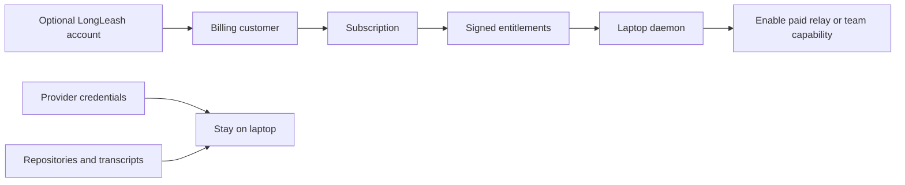

# Public launch, accounts, and future billing

**Decision recorded 2026-08-14:** launch the free public preview without a mandatory LongLeash
account. Device pairing remains the product identity. Do not build login merely to count users.

## Why accountless is right for the initial release

- The core product runs on the user's laptop and already has a strong device-pairing identity.
- A login would add password recovery, email verification, abuse controls, deletion/export paths,
  breach response, and another availability dependency before it delivers user value.
- Requiring an account would weaken the local-first promise and increase the exact setup friction
  LongLeash exists to remove.
- Product traffic can be measured without learning who owns a repository or conversation.

The public preview therefore has no signup form, email collection, account database, or billing
screen. The website must say this plainly.

## Launch measurement without identity

After the branded domain is attached, the smallest acceptable measurement layer is optional,
privacy-preserving aggregate web analytics for public pages. It must not run inside paired session
content, include pairing fragments or query strings, or create a cross-site user profile.

If a beta mailing list is later useful, it is a separate opt-in form with:

- an explicit purpose and consent statement;
- a published processor and retention/deletion policy;
- Cloudflare Turnstile or equivalent abuse protection with mandatory server-side verification;
- no link between the email address and device pairing, provider identity, project, or transcript.

References: [Cloudflare Web Analytics data collection](https://developers.cloudflare.com/web-analytics/data-metrics/data-origin-and-collection/)
and [Turnstile setup](https://developers.cloudflare.com/turnstile/get-started/).

## Future paid architecture

The current commercial source of truth is
[`MONETIZATION-PLAN.md`](MONETIZATION-PLAN.md). The public preview remains accountless. If validated
demand later funds a paid hosted or team service, an account becomes optional commercial identity;
it does not replace device pairing and is never required for local/self-hosted use.

A paid service can add an **optional commercial account plane** without turning LongLeash into a
hosted coding environment:

The account database may hold login, billing-customer reference, plan, entitlement state, team
membership, and support metadata. It must not hold provider credentials, repositories, transcript
content, tool inputs, or pairing secrets.

The provisional commercial stack is a managed passwordless identity provider plus a Merchant of
Record and a LongLeash-owned entitlement service. A Merchant of Record is preferred for the first
global paid launch because sales-tax/VAT handling is material for a solo operator. Lemon Squeezy is
the current billing hypothesis, subject to eligibility and legal review; Stripe remains an option
if tax registrations and compliance are deliberately handled. The daemon receives a short-lived,
scoped, signed entitlement—not a payment credential. This is a plan, not authorization to create
vendor accounts or collect user data.

## Gates before accounts ship

1. A paid feature with demonstrated demand exists; “track users” is not sufficient.
2. Domain, support contact, privacy notice, terms, refund policy, and data-deletion path are live.
3. Authentication, session security, rate limits, abuse response, audit, backup, and recovery have tests.
4. Billing webhooks are idempotent, signed, replay-safe, and tested against cancellation, failure,
   refund, grace-period, and plan-change states.
5. The free accountless path and local product boundary remain documented and tested.

Until those gates and the validation thresholds in `MONETIZATION-PLAN.md` pass, the product launches
accountless and no checkout is built.
