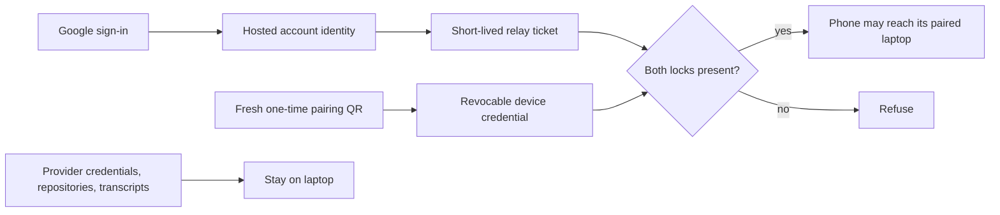
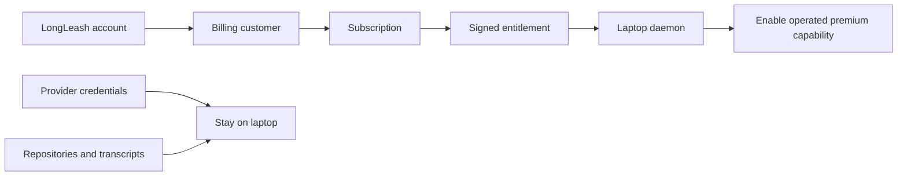

# Public accounts, device authority, and future billing

**Decision updated 2026-08-15:** the official hosted app requires a free Google-backed LongLeash
account. LAN and self-hosted deployments remain accountless. The account is an identity and hosted-
service boundary; it does not replace the pairing QR or become a repository/transcript sync plane.

## The two-lock model

Google sign-in answers **who is using the hosted service**. Pairing answers **which browser may
control which laptop**. Signing in alone grants no laptop authority. Possessing an account does not
reveal another account's browser credentials. The pairing secret and frame key are never sent to
Google, Clerk, or a central LongLeash database.

## Hosted and local modes

| Mode | LongLeash account | Device pairing | Hosted relay ticket |
| --- | --- | --- | --- |
| `https://app.longleash.dev` | Required | Required | Required for the browser/guest socket |
| Laptop LAN origin | Not required | Required | Not used for the direct path |
| Self-hosted relay/app | Operator choice; default accountless | Required | Not required by the reference Node relay |
| Legacy workers.dev migration origin | Browser redirects to branded sign-in | Required | Guest ticket required; old laptop host sockets remain compatible |

The workers.dev origin is a transport migration control, not an accountless entrance. Ordinary
browser requests redirect to `app.longleash.dev`; guest sockets require hosted authorization on
both origins. Only the laptop host socket remains accountless because its unguessable pairing room
and end-to-end key are the device authority, and older installed daemons must not be stranded.

## What the account stores

Clerk is the initial account system and authoritative registered-user count. It may store a stable
user identifier, name, email, profile image, sign-in timestamps, and session/security metadata.
LongLeash does not duplicate this into D1 merely to count users. Add D1 only when first-party plan,
entitlement, organization, consent, or audit state genuinely exists.

Browser pairing credentials are scoped by Clerk user ID in local storage. They are not uploaded.
Existing unscoped credentials are intentionally not auto-migrated: the first account-enabled launch
requires a fresh QR rather than silently assigning an old paired device to whoever signs in first.

The hosted relay ticket is:

- valid for 45 seconds;
- HMAC signed and bound to one opaque room and the guest role;
- associated with a one-way account tag rather than the raw Clerk user ID;
- delivered after a same-origin, bearer-authenticated POST;
- stripped before the request enters the room Durable Object;
- unable to decrypt or forge end-to-end encrypted session frames.

## Google and Clerk configuration

The production OAuth client requests only `openid`, `email`, and `profile`. It must not request
Gmail, Drive, GitHub, repository, contacts, calendar, or provider scopes. Clerk production must use:

- root domain `longleash.dev`;
- Frontend API host `clerk.longleash.dev` and Account Portal host `accounts.longleash.dev`;
- subdomain allowlist containing only `app.longleash.dev` (plus an explicit host later if needed);
- Worker-side `authorizedParties: ['https://app.longleash.dev']`;
- redirect URLs copied exactly from Clerk into Google Cloud;
- project-owner MFA and no secrets committed to Git.

The publishable key may be public. `CLERK_SECRET_KEY` and `RELAY_TICKET_SECRET` are Worker secrets and
must be entered with `wrangler secret put`, never placed in `.env`, source, chat, or screenshots.

## User rights and operational paths

The app account control provides:

- sign out;
- a JSON export of hosted account fields exposed to the browser, excluding secrets;
- permanent Clerk account deletion after typed confirmation;
- clear notice that laptop-local transcripts are not deleted by deleting a hosted identity.

The public site must keep `/privacy` and `/terms` live and name working `privacy@`, `security@`, and
`support@longleash.dev` mailboxes before public promotion. Sensitive reports never belong in a
public GitHub issue.

## Future paid architecture

The commercial source of truth is [`MONETIZATION-PLAN.md`](MONETIZATION-PLAN.md). A later billing
service attaches entitlements to the existing hosted account; it does not create a second identity
system or weaken local-first boundaries.

The future first-party database may hold billing-customer reference, plan, entitlement state, team
membership, consent, and support/audit metadata. It must never hold provider credentials,
repositories, transcript content, tool inputs, approval content, pairing secrets, or frame keys.

## Release gates

1. Canonical domains, certificates, redirect, health, and workers.dev rollback are verified.
2. Google production OAuth and Clerk custom domain are configured with MFA and least scopes.
3. Cross-account storage isolation, OAuth pairing-fragment preservation, ticket tampering, expiry,
   room/role binding, rate limits, and fail-closed configuration pass automated tests.
4. Terms, privacy, export, deletion, support, and private security reporting are actually reachable.
5. A fresh iPhone home-screen install completes sign-in, pairing, cellular reconnect, approval,
   account switch isolation, sign-out, export, and deletion checks.
6. Local/LAN and self-hosted accountless paths still pass their existing contract suites.
7. No checkout ships until the demand and billing gates in `MONETIZATION-PLAN.md` pass.
