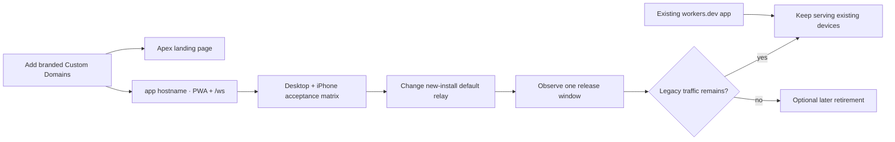

# Public launch and branded domains

LongLeash uses one Cloudflare Worker for the PWA assets, health endpoint, WebSocket relay, and
Durable Object rooms. The public website and the paired app should have separate branded
hostnames even though the same Worker may serve both:

| Surface | Recommended hostname | What opens there |
| --- | --- | --- |
| Public website | `longleash.<tld>` | Product, setup guide, security, docs, and roadmap |
| Canonical alias | `www.longleash.<tld>` | Permanent redirect to the public website |
| Product + relay | `app.longleash.<tld>` | Pairing/PWA at `/`, relay at `/ws`, status at `/health` |
| Legacy compatibility | `longleash-relay.<account>.workers.dev` | Existing paired devices and rollback path during migration |

This split prevents an unpaired visitor from seeing the pairing gate instead of the product site,
and prevents a paired home-screen app from being replaced by a brochure on refresh.

## Why renaming the Worker is not enough

A `workers.dev` address is formed from the Worker name and the Cloudflare account subdomain:

```text
<worker-name>.<account-subdomain>.workers.dev
```

Changing `longleash-relay` changes only the first part. The account subdomain is shared by the
account, so changing it can affect other Workers and still leaves a `workers.dev` development
address. Cloudflare recommends a Custom Domain when the Worker itself is the public origin. See
[Workers routing](https://developers.cloudflare.com/workers/configuration/routing/workers-dev/)
and [Custom Domains](https://developers.cloudflare.com/workers/configuration/routing/custom-domains/).

## What the repository already supports

The Worker has fail-safe host-aware routing:

- with no public-host configuration, the existing `workers.dev` behavior is unchanged;
- the configured apex serves the landing page at `/`;
- `www` redirects permanently to the apex;
- the configured app hostname continues to serve the PWA and `/ws`;
- a legacy query-style pairing link accidentally opened on the apex is redirected to the app host
  with its complete query intact;
- new pairing links put their temporary secret in the URL fragment (`#c=…&s=…`), which a browser
  does not send in the HTTP request to Cloudflare;
- the old `workers.dev` address remains usable until the migration has passed real-device testing.

The public page is also available at `/welcome` on the legacy origin for preview and rollback.
Its documentation, troubleshooting, roadmap, privacy, and license pages stay on the public site;
GitHub is an explicit source-code and issue-tracker destination, not the reading experience.

The preview launches without a mandatory login. Pairing remains device identity, while any future
billing account is an optional entitlement plane that never stores provider credentials,
repositories, or transcripts. See [Public launch, accounts, and future billing](PUBLIC-ACCOUNT-STRATEGY.md).

## One-time owner steps

These steps require the domain owner and therefore are not safe for an automated coding session to
guess or perform without the exact hostname.

1. Own a domain appropriate for LongLeash. Do not buy a domain based only on an unverified search
   result; confirm the registrar price, renewal price, and trademark risk yourself.
2. Add that domain as an active zone in the same Cloudflare account as the Worker. If it is
   registered elsewhere, Cloudflare will give you nameservers to set at the registrar.
3. Confirm there are no existing CNAME records on the exact apex, `www`, or `app` hostnames.
   Cloudflare cannot attach a Worker Custom Domain over a conflicting CNAME.
4. Enable a private vulnerability-reporting channel in GitHub or provide a dedicated security
   email, then add that exact channel to the public Security/Privacy copy. Never ask researchers to
   publish credentials or exploit details in an ordinary issue.
5. Give the maintainer the exact zone and desired hostnames. Only then add the three Custom Domains
   to `packages/relay/wrangler.jsonc` and configure:

   ```jsonc
   {
     "routes": [
       { "pattern": "longleash.example", "custom_domain": true },
       { "pattern": "www.longleash.example", "custom_domain": true },
       { "pattern": "app.longleash.example", "custom_domain": true }
     ],
     "vars": {
       "PUBLIC_SITE_HOST": "longleash.example",
       "PUBLIC_WWW_HOST": "www.longleash.example",
       "PUBLIC_APP_HOST": "app.longleash.example"
     }
   }
   ```

6. Build and run a Wrangler dry run before deployment:

   ```sh
   pnpm --filter @longleash/app build
   pnpm --dir packages/relay exec wrangler deploy --dry-run
   ```

7. Deploy, then wait for Cloudflare to provision the DNS records and certificates. Custom Domains
   let Cloudflare manage both automatically.

## Migration order—do not strand paired phones

The legacy origin stays enabled during the transition. Migration is deliberately additive:



After branded routing passes, update these public defaults together in one release:

- `scripts/install.sh` — new installations use `wss://app.<domain>/ws`;
- `scripts/release.sh` — release verification reads `https://app.<domain>/build.json`;
- `docs/ACCEPTANCE.md` and this guide — branded smoke-test URLs;
- the landing page's production app URL, if it cannot be derived from `app.<apex>`.

Existing installations remember their relay URL. Do not silently rewrite it while a daemon is
running. They can keep using `workers.dev` through the compatibility window or explicitly update
after the new host is verified.

## Mandatory release gate

Run all of the following before calling the branded release live:

```sh
pnpm typecheck
pnpm test
pnpm build
pnpm --dir packages/relay exec wrangler deploy --dry-run
curl -fsS https://app.longleash.example/health
curl -fsS https://app.longleash.example/build.json
curl -I https://www.longleash.example/
```

Also require HTTP 200 and the LongLeash public shell at every first-party route:

```text
/
/docs
/docs/getting-started
/docs/daily-use
/docs/troubleshooting
/docs/security
/docs/session-portability
/docs/faq
/roadmap
/privacy
/license
```

Click every landing documentation card and footer link on desktop and a narrow phone viewport.
Documentation, roadmap, privacy, and license must stay on the branded site. Only **Source on
GitHub**, installer source, implementation evidence, and issue-reporting actions should leave it.

Then perform the complete [real-device acceptance checklist](ACCEPTANCE.md) on a new iPhone home
screen install and on an already-paired device. The QR must open the app hostname, pairing must
complete, the app must reconnect over cellular, and `longleash doctor` must report matching builds.

## Rollback

Do not delete the `workers.dev` deployment during launch. If a branded certificate, DNS record,
PWA update, or WebSocket route fails:

1. leave existing devices on the legacy origin;
2. restore the previous Worker version in Cloudflare;
3. point new-install documentation back to the known-good origin;
4. preserve the failing build ID, exact hostname, time, and Cloudflare request ID before retrying.

The domain is presentation and routing, not the trust boundary. Relay payloads remain
end-to-end encrypted on either hostname; Cloudflare can still observe traffic timing, size, IP
metadata, and connection activity.
