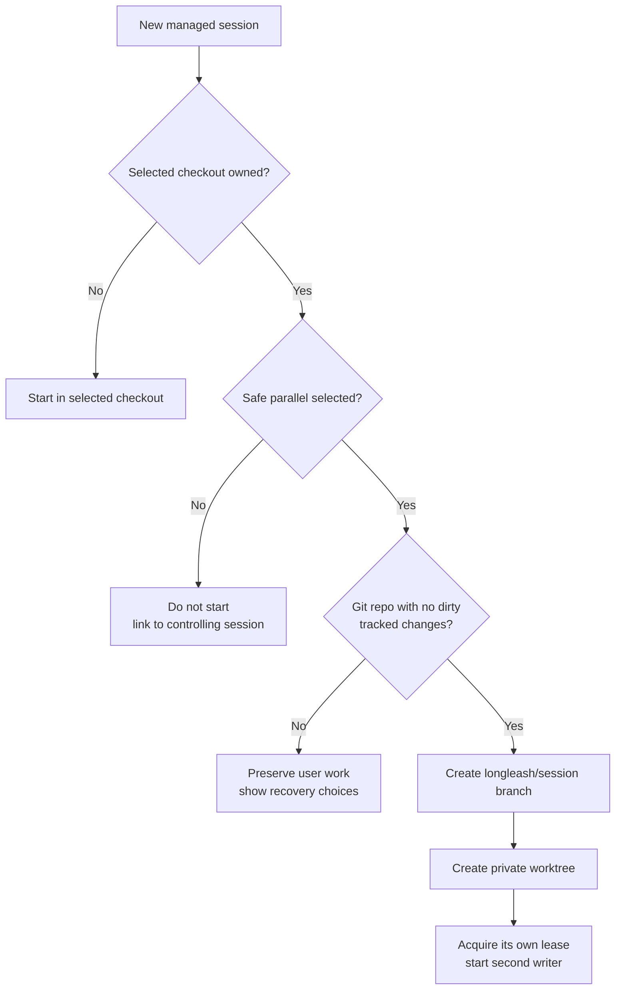
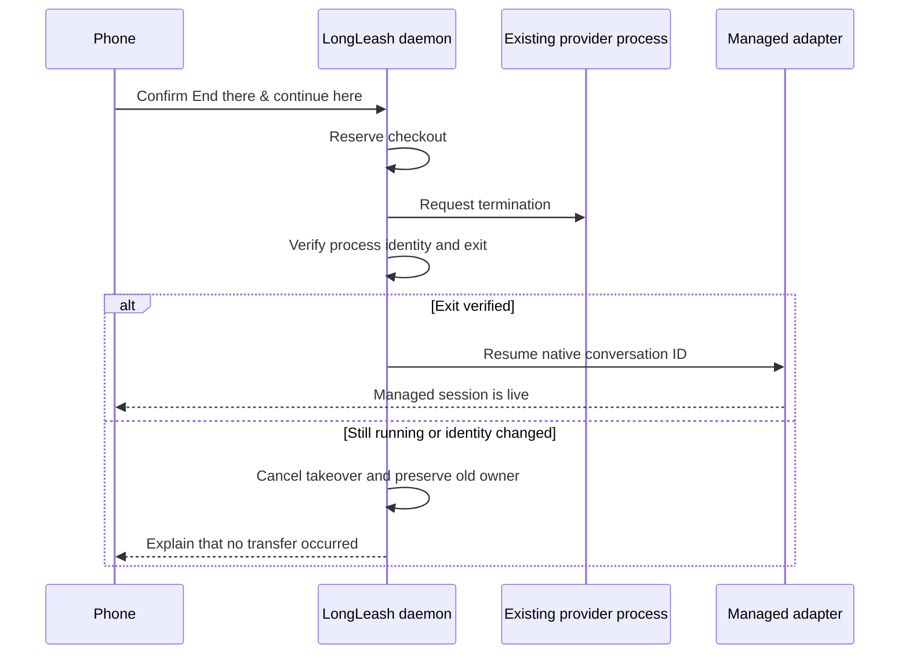

# Session portability and safe parallel work

## Parallel sessions in one project

The New session sheet defaults to **Safe parallel**:



- If the selected checkout is idle, the agent uses it directly.
- If another agent owns it, LongLeash creates a Git worktree under its private data directory and
  starts the new agent on a `longleash/<session>` branch.
- Uncommitted tracked changes stop isolation with a clear error; LongLeash never starts from an
  older HEAD while pretending it copied those edits.
- Non-ignored untracked files are copied as untracked files. Git-ignored files and dependency
  directories are not copied.
- Worktrees are preserved when sessions end. LongLeash never auto-commits, merges, pushes, or
  deletes agent work.

Non-Git folders remain sequential because there is no provider-neutral, lossless merge boundary.
Manually starting two terminal or VS Code agents in the exact same checkout also remains
sequential; use the phone's Safe parallel launch or the vendor's own worktree option.

## Moving a conversation between surfaces

Every Claude or Codex session with a native conversation id shows a handoff panel, regardless of
whether it began on the phone, in Terminal, or in VS Code. The command can be copied immediately.
If a writer is still live, release it before running the command.

The VS Code workspace option opens the project before resuming. Claude resumes with its `--ide`
connection; Codex resumes in the terminal where the command was run. VS Code's vendor chat webviews
are sealed: LongLeash cannot inject or reopen a native chat panel without the planned companion
extension. The UI states this boundary rather than claiming a handoff it cannot perform.

Moving an active terminal/IDE conversation to the phone is an explicit confirmation. The daemon
reserves the checkout, asks the native process to stop, verifies that it exited, and only then
resumes the conversation. If exit is not verified, the takeover is cancelled and the old writer
keeps ownership.



## Session settings

New managed sessions expose provider-backed controls for model and reasoning effort. Claude also
supports adaptive, disabled, or fixed-budget thinking. The settings are validated, persisted with
the session, and reused after daemon restart or conversation wake. Approval policy and filesystem
safety stay managed by LongLeash and are not weakened by this screen.

Provider defaults are the safest first diagnostic when a model-specific launch fails. Custom model
IDs are passed through but can still be rejected by the installed CLI, account, or provider. See
[Troubleshooting model and reasoning settings](TROUBLESHOOTING.md#model-effort-or-thinking-settings-fail).

## Recovery and cleanup

LongLeash deliberately preserves isolated work after a session ends. Inspect it with:

```sh
git worktree list
git branch --list 'longleash/*'
```

Review and merge through normal Git workflows. Until a typed review/merge/cleanup flow ships,
LongLeash does not remove a worktree or branch for you. Do not delete entries inside
`~/.longleash` manually; that can separate durable session metadata from the files it references.

For ownership conflicts, active-writer errors, missing resume commands, or VS Code exit banners,
use [Troubleshooting LongLeash](TROUBLESHOOTING.md#a-session-cannot-send-stop-or-move).
