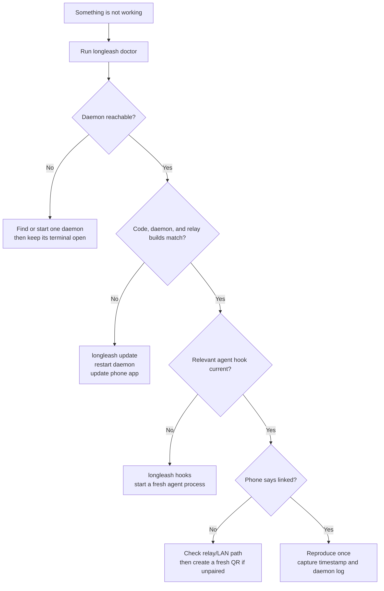

# Troubleshooting LongLeash

This guide starts with symptoms, protects useful evidence, and avoids destructive “fixes.” If a
step does not match what you see, stop and record the exact message rather than repeatedly pairing,
restarting, or killing processes.

## First sixty seconds

Run these **before** restarting the daemon:

```sh
longleash doctor
tail -n 150 ~/.longleash/daemon.log
```

Record:

- local time and timezone;
- Claude or Codex;
- `from your phone`, `in a terminal`, or `in VS Code`;
- the session title and project path, but redact private path segments before posting publicly;
- what you tapped and what happened;
- a screenshot with pairing links, tokens, and private source code removed.

> [!CAUTION]
> A pairing URL contains a temporary secret. Never paste it into an issue or reuse one shown in a
> screenshot. Press `n` + Enter in the daemon terminal to invalidate uncertainty and create a new
> single-use QR.

## Diagnostic map



## Pairing fails

### “Your laptop did not answer”

1. Leave the terminal running `longleash` open.
2. In another terminal, run `longleash doctor`. The daemon must say `reachable`.
3. Return to the daemon terminal and press `n`, then Enter.
4. Scan that new QR. Pairing URLs are single-use; a failed or completed attempt cannot be reused.
5. If LongLeash is already installed on the home screen, use its own **Scan the QR** button. The
   iPhone Camera app may open Safari and pair Safari's storage instead of the installed PWA.
6. If scanning remains unreliable, paste the complete new link into the pairing field.

If doctor says the relay is configured but the phone still cannot reach the laptop, open the relay
URL itself on the phone. A page that cannot load indicates a phone/DNS/relay problem; a page that
loads but never links usually indicates the daemon's relay connection or stale pairing state.

### Pairing worked in Safari but not in the home-screen app

Browser tabs and installed PWAs have separate storage contexts on iOS. Open the home-screen app,
choose its scanner, and pair it with a fresh QR. Do not copy browser storage or reuse the old link.

### The in-app camera is soft or the QR will not scan

1. Fit the QR's complete white border inside the finder. Moving the phone farther away is usually
   better than filling the finder with cropped QR pixels.
2. Tap **Refocus** and hold the phone still for a moment.
3. If **Switch lens** appears, try the next rear lens. iPhones may expose several physical and
   virtual rear cameras, and their close-focus distances differ.
4. Turn the laptop display brightness up enough to avoid glare and wipe the phone camera lens.
5. In the daemon terminal, press `n`, then Enter, and scan the fresh QR. Do not scan an old
   screenshot—the link is single-use.
6. If WebKit still produces a soft or frozen stream in the installed app, paste the complete fresh
   pairing link. That follows the same pairing protocol and does not weaken authentication.

The in-app scanner requests a high-resolution rear stream and continuous focus when the browser
exposes that capability. Camera selection and focus remain partly controlled by iOS, so the lens
and refocus controls are deliberate recovery paths, not cosmetic settings.

### Start over after a lost or exposed phone

```sh
longleash devices
longleash revoke <device-id>
```

Use `longleash revoke --all` only when you intend to disconnect every phone. Revocation is
immediate and requires fresh pairing afterward.

## The daemon will not start

### “LongLeash is already running”

Only one daemon should serve a laptop profile. Use the existing process and run:

```sh
longleash doctor
```

If you can access its terminal, press `q` + Enter there and restart normally. If its terminal is
gone, identify the listener before stopping anything:

```sh
lsof -nP -iTCP:4321 -sTCP:LISTEN
ps -p <PID> -o pid,ppid,command
```

Only send `kill <PID>` after the second command proves it is the stale LongLeash process. Never use
an unreviewed broad `pkill`, recursive deletion, or copied `lsof | xargs kill` command.

### “Connection refused”

This normally means the endpoint recorded for provider hooks has no live daemon behind it.

1. Run `longleash doctor`.
2. If unreachable, start `longleash` and keep it running.
3. If doctor points at an old build, update and restart rather than running a second daemon.
4. If the daemon exits, inspect the last log lines before retrying:

   ```sh
   tail -n 150 ~/.longleash/daemon.log
   ```

An unrelated process on port 4321 is not fatal; LongLeash can select a free port. An existing
LongLeash is different and must not be duplicated.

### Relay-only start works, but LAN does not

`linked · relay` is a valid operating mode. The daemon always connects outward to the relay. LAN
direct mode additionally requires the phone and laptop to reach each other on the same network.
Guest Wi-Fi, client isolation, VPN routing, and HTTPS mixed-content browser rules can prevent the
direct path without breaking relay operation. See [Direct versus relay](DEPLOY.md#linked-direct-vs-linked-relay).

## The phone has old behavior

### Build mismatch or missing Update button

```sh
longleash update
```

Then:

1. stop the currently running daemon;
2. start `longleash` again—the old process cannot load new code from disk;
3. tap **Update** in the app if offered, or pull down to refresh;
4. run `longleash doctor` and require laptop, daemon, and relay builds to match.

The relay serves the phone bundle. A local `git pull` or local app build alone cannot update what a
remote phone downloads. Maintainers/self-hosters must deploy the relay bundle with
`longleash release`; see [Deploying the relay](DEPLOY.md).

### The app renders strangely immediately after refresh

Wait for the update/reconnect state to settle once. If it persists, record the phone model, OS,
browser/PWA mode, orientation, page, and a screen recording. Also record whether the build-mismatch
banner was present. Do not diagnose layout against a stale phone bundle.

## Terminal or VS Code sessions are missing

1. Run `longleash doctor`.
2. If a hook is stale or missing, repair it:

   ```sh
   longleash hooks
   ```

3. Start a **new** Claude/Codex process. A process already open before a hook update retains the old
   environment and configuration.
4. On Codex's first launch after hook changes, review and trust the hook when Codex asks. LongLeash
   deliberately does not bypass the provider's trust prompt.
5. Cause one lifecycle or tool event. Hook-observed sessions become visible when the provider emits
   an event; LongLeash does not scrape the screen looking for them.

If the card appears with the wrong provider/origin or appears twice, capture the exact start time,
session title, and daemon log. Do not open more sessions to “shake it loose”; duplicates are useful
evidence of an identity bug.

## Approvals or questions do not work

### Nothing appears on the phone

- Confirm the phone says `linked`.
- Confirm the session card is live and has the expected provider/origin labels.
- Confirm hooks and builds with `longleash doctor`.
- Some provider/user rules auto-approve tools before LongLeash is asked. Those actions should still
  appear in Activity. See [What runs without asking](REQUIREMENTS.md#what-runs-without-asking-you).
- Start the daemon with `LONGLEASH_ASK_EVERYTHING=1 longleash` if you intentionally want managed
  sessions to ask even for normally pre-approved reads.

### An approval stays after it was answered

Do not approve it again. Record the session, decision, and time, refresh once, and compare builds
with doctor. A decided or ended-session approval must not return. Capture the daemon log before a
restart so the stale-event sequence can be diagnosed.

### Return the decision to the laptop

For a currently waiting supported provider prompt, press `L` once in the laptop terminal without
Enter. The native provider prompt should take over the decision. The phone item must then disappear
or become non-actionable.

## A session cannot send, stop, or move

### “This checkout is already controlled”

One physical checkout permits one writer. Use one of these safe choices:

- open the controlling session and continue there;
- stop/release it, then start in **Same checkout**;
- select **Safe parallel** to create a Git worktree and separate branch.

If Safe parallel refuses a dirty tracked tree, LongLeash is protecting changes that are not in
HEAD. Review and commit them yourself, or keep working in the current session. LongLeash will not
stash, commit, overwrite, or silently omit those changes for you.

Inspect preserved isolated work without modifying it:

```sh
git worktree list
git branch --list 'longleash/*'
```

Read [Session portability](SESSION-PORTABILITY.md) before manually merging or removing a worktree.

### Resume says “already has an active writer”

The provider believes another process still owns the native conversation. Do not retry the resume
command in multiple terminals.

1. Return to the original Terminal/VS Code process and finish or stop it.
2. In LongLeash, use **Release current run** and wait for the session to become non-live.
3. Run the copied handoff command once.

If the old process is gone but the error persists, record its session ID and provider error. Do not
edit provider transcript files or lock metadata by hand.

### “Preparing the exact terminal command…” never resolves

A handoff requires the provider's native conversation ID. For a fresh session, allow its initial
response/lifecycle event to arrive. For Terminal/VS Code origins, verify current hooks. Very old
history captured before native IDs were stored may remain readable but cannot be given a truthful
resume command.

### Stop or takeover appears to do nothing

For external sessions LongLeash signals the verified provider process, waits for it to exit, and
only then transfers the checkout. This can take several seconds. Do not repeatedly tap Stop or
start a competing resume command during that interval.

If exit is not verified, takeover is cancelled and the original writer keeps ownership. Capture:

```sh
longleash doctor
tail -n 150 ~/.longleash/daemon.log
```

Also check whether the original provider process is still visibly alive. Never claim a successful
handoff while both processes remain active.

### VS Code shows process exit code 143

Code 143 means a process received SIGTERM. It can be expected **after you explicitly confirmed** an
external VS Code-to-phone takeover, because the old provider process must close before LongLeash
resumes its conversation. The vendor panel may display its own termination banner.

It is a bug if this happens without an explicit Stop/takeover/return confirmation, if LongLeash says
the transfer succeeded before exit, or if the resumed conversation loses context. Capture both the
VS Code output and daemon log with timestamps.

## Model, effort, or thinking settings fail

- Start with **Provider default** to distinguish a LongLeash lifecycle problem from a provider
  model-entitlement problem.
- A custom model ID is passed to the provider and may be unavailable to your account or installed
  CLI.
- Codex exposes thinking through reasoning effort; it does not accept Claude's separate thinking
  configuration.
- Claude fixed thinking requires an integer token budget from 1,024 through 128,000.
- Settings apply to LongLeash-managed starts and are reused on managed wake/restart. They do not
  rewrite an already-running external provider process.

Record the exact provider rejection. LongLeash should surface it and return the session to a
non-working state rather than leaving an endless spinner.

## Notifications do not work

### No alerts on iPhone

- Install LongLeash to the home screen; normal Safari tabs cannot provide the same iOS web-push
  behavior.
- Open the installed app and inspect its Alerts panel. It names unsupported, denied, stale-daemon,
  ready, and enabled states separately.
- If permission was denied at the OS level, re-enable it in iOS notification settings.
- Send the built-in test alert, then lock the phone during its delay.

### A notification opens Home or the wrong session

Update the daemon and phone bundle, then test with a newly created approval. Warm-open and
cold-start notification paths differ; test both. Record the originating session, whether the app
was already open, and which page appeared.

Push content is deliberately minimal. It carries identifiers only; the app must reconnect and load
the current approval before showing details.

## Delegate does not start or return

- Delegation is human-reviewed: the briefing and return must be confirmed; socket delivery alone
  is not treated as success.
- V1 delegated children use sequential workspace ownership. If the source owns the checkout, the UI
  must explain the transfer rather than starting a hidden second writer.
- A return into a live Terminal/VS Code source requires explicit takeover confirmation.
- Retries use idempotency keys; repeated taps must not create duplicate children or returns.

Capture the parent title, child title if created, role, source/target provider, and failure message.
Do not manually paste a return into the parent and then report the automated path as successful.
See [Delegate release-quality verification](DELEGATION.md#release-quality-verification).

## Reporting a useful bug

Include:

```text
LongLeash build:
Daemon reachable/build:
Relay build:
Phone model + OS:
PWA or browser tab:
Agent + CLI version:
Origin: phone / Terminal / VS Code
Project type: Git / non-Git
Exact local time + timezone:
Expected:
Observed:
Reproduces after one clean retry: yes/no
```

Attach the relevant `longleash doctor` output and a narrow daemon-log excerpt. Remove source code,
tokens, pairing links, home-directory usernames, and customer data. Never publish:

- a pairing QR or URL;
- `~/.longleash` databases or secret files;
- `~/.claude` or `~/.codex` authentication material;
- an entire transcript when a short redacted event sequence is enough.

For a release decision—not only a bug diagnosis—run the complete
[real-device acceptance checklist](ACCEPTANCE.md).
