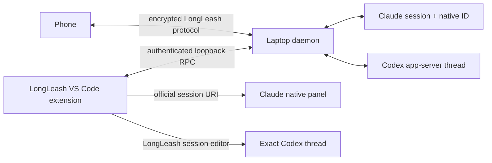
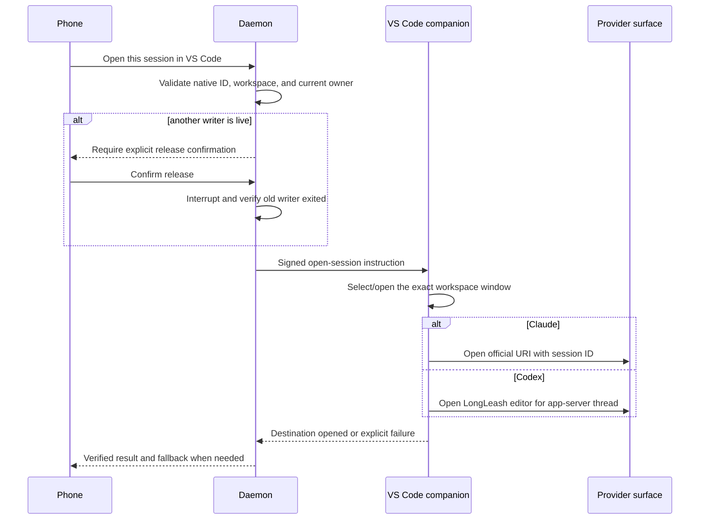

# LongLeash VS Code companion — Product and engineering plan

**Status:** planned for Phase 2A; no implementation is claimed by this document

**Owner:** LongLeash
**Working name:** LongLeash for VS Code

This is the durable source of truth for the companion extension. It records the supported vendor
boundaries, product contract, architecture, rollout sequence, and release gates so implementation
does not depend on remembered conversation context.

## Product decision

LongLeash will build a VS Code companion extension. It is not required for the phone product or
ordinary Terminal handoff, but it is required for the premium IDE experience: one visible place to
find sessions, move between phone and desk, review changes, and control cross-provider work.

The extension must use public, documented provider and VS Code contracts. It must never scrape a
terminal UI, alter another extension's webview, call private extension commands, or claim a native
handoff that it cannot verify.

## Correct vendor boundary

The two providers have different supported paths:

| Provider | Supported exact-session IDE path | LongLeash behavior |
| --- | --- | --- |
| Claude | Claude Code registers `vscode://anthropic.claude-code/open?session=<id>`. Its CLI and extension share local conversation history. | Open the correct workspace, verify that LongLeash has a native Claude session ID, then use the official URI to reopen/focus that conversation in Claude's native panel. |
| Codex | Codex documents `app-server` for rich clients, including history, approvals, streamed events, and `thread/resume`; no documented external deep link into a specific Codex extension panel is currently part of the contract. | Open the exact Codex thread in a LongLeash-owned VS Code editor backed by the daemon's existing app-server session. Offer Terminal resume as the universal fallback. |

Official references:

- [Claude Code in VS Code](https://code.claude.com/docs/en/vs-code)
- [Codex IDE extension](https://learn.chatgpt.com/docs/codex/ide)
- [Codex app-server](https://learn.chatgpt.com/docs/app-server)
- [VS Code Webview API](https://code.visualstudio.com/api/extension-guides/webview)

This distinction is user-visible only when needed. The primary action is **Open in VS Code**;
LongLeash chooses the strongest supported route and labels the destination honestly.

## Product contract

The extension will provide:

- A LongLeash Activity Bar container with **Needs you**, **Active**, **Earlier**, and delegation
  relationships.
- One **Open in VS Code** action from the phone and one **Continue on phone** action in VS Code.
- Exact provider, origin, workspace, branch/worktree, live state, and ownership labels.
- Approval, answer, Stop, reopen, Delegate, reviewed Return, and safe release controls.
- Native file/diff navigation and visible test, diagnostics, and branch summaries.
- Deterministic workspace/window targeting when several VS Code windows are open.
- A useful offline, version-mismatch, untrusted-workspace, or missing-provider explanation.
- A copyable Terminal fallback whenever native IDE continuation cannot be verified.

The extension will not:

- inject into, read, or modify another extension's private webview;
- use undocumented Claude or Codex command identifiers;
- promise that Codex opened in OpenAI's panel;
- send an IDE selection, file contents, diagnostics, or terminal output without a visible user
  action or explicitly enabled setting;
- create a generic remote shell endpoint;
- bypass LongLeash workspace leases, approvals, or human merge review.

## Architecture

### Package boundary

Create `packages/vscode` as a separately versioned VS Code extension. Keep orchestration,
provider credentials, transcripts, workspace leases, and process ownership in `longleashd`.
The extension is a thin authenticated client and IDE actuator, not another daemon.

Prefer native VS Code surfaces:

- `TreeDataProvider` for session and task navigation;
- commands and Quick Picks for short actions;
- status bar for connection/build health only;
- native diff, diagnostics, source-control, test, and file-opening APIs;
- a webview editor only where a streamed conversation genuinely needs custom rendering.

### Local trust boundary

The extension communicates only with the laptop daemon over loopback or a user-owned local socket.
It receives its own least-privilege capability credential during installation/registration. Do not
reuse the hook secret or a phone device token. Store the credential in VS Code secret storage and
rotate/revoke it independently.

The extension protocol is typed and capability-negotiated. A build mismatch disables mutations
and leaves diagnostics/read-only navigation available. Every mutation includes an operation ID and
is audited by the daemon.

### One-writer handoff

Opening a window is not proof that the intended conversation opened. The acknowledgement must name
the provider, native session/thread ID, workspace, extension build, and destination kind. If Claude
cannot find the requested session, LongLeash reports failure rather than treating Claude's fresh
conversation fallback as success.

## Delivery phases

### Phase V0 — Contract and security spikes

- [ ] Verify Claude's official session URI from an independent extension across same-window,
  multi-window, multi-root, worktree, missing-session, and already-open cases.
- [ ] Verify the Codex app-server thread can have one daemon owner and multiple read-only UI clients
  without creating an active-writer race.
- [ ] Specify the extension authentication, capability negotiation, revocation, and audit protocol.
- [ ] Specify workspace trust behavior and a no-secrets logging policy.
- [ ] Record minimum supported VS Code, Claude Code, and Codex versions by tested capability.

**Exit:** the two exact-session paths and the trust boundary are demonstrated in disposable test
workspaces. Any unsupported case has a Terminal fallback and honest UI copy.

### Phase V1 — Companion foundation

- [ ] Extension package, CI, VSIX artifact, install/update command, and version diagnostics.
- [ ] Activity Bar session tree with provider, origin, status, workspace, and relationship labels.
- [ ] Authenticated reconnect and cursor replay through the daemon.
- [ ] Open workspace/file, reveal source range, and focus an existing LongLeash session.
- [ ] Read-only transcript editor with long-history virtualization and accessible keyboard behavior.
- [ ] Offline, daemon-missing, revoked, build-mismatch, and workspace-untrusted states.

**Exit:** VS Code shows the same durable session inventory as the phone after reload, daemon restart,
and network interruption; no mutation is available under an incompatible or unauthenticated link.

### Phase V2 — Exact continuation and control

- [ ] Claude native-panel handoff using its documented session URI.
- [ ] Codex LongLeash editor using the existing app-server-backed session.
- [ ] Release/takeover confirmation with verified provider-process exit.
- [ ] Approval, question, Stop, reopen, Delegate, and reviewed Return controls.
- [ ] Phone notification/open requests target the correct VS Code window and session.
- [ ] Universal copyable Terminal fallback.

**Exit:** a real Claude or Codex conversation can move phone → VS Code → phone without losing
history, duplicating a writer, opening the wrong workspace, or silently starting a new conversation.

### Phase V3 — IDE context and review

- [ ] Explicitly attach current selection, open file, diagnostics, or test result to a prompt.
- [ ] Native file and line links from transcript/tool events.
- [ ] Change summary, branch/worktree status, and native diff review.
- [ ] Human-reviewed merge/cherry-pick/handoff entry points supplied by the daemon's typed APIs.
- [ ] Clear disclosure of what IDE context crosses into which provider.

**Exit:** the extension materially improves review and context transfer while preserving explicit
consent, workspace isolation, and provider attribution.

### Phase V4 — Parallel specialist workspace

- [ ] Parent/child delegation tree and compact mission overview.
- [ ] Multiple isolated children with role, owner, branch, tests, and return state.
- [ ] Pause, redirect, retry, preserve, and safe cleanup controls.
- [ ] Conflict and uncertain-delivery recovery without hidden retries.
- [ ] Runtime, agent-count, depth, and usage budgets surfaced before launch.

**Exit:** Phase 2's isolated specialists are understandable and safely reviewable from both phone
and VS Code; the extension never becomes an autonomous, unbounded agent loop.

### Phase V5 — Distribution and premium release gate

- [ ] Unit tests for state reducers, URI construction, capability negotiation, and redaction.
- [ ] VS Code extension-host integration tests for commands, views, trust, secrets, and reconnect.
- [ ] Real-provider matrix for Claude/Codex, phone/Terminal/VS Code origins, and all handoff paths.
- [ ] macOS release gate first; documented Windows/WSL/Linux support status before marketplace copy.
- [ ] Signed VSIX, Marketplace/Open VSX publishing, staged updates, rollback, and compatibility policy.
- [ ] Accessibility, large transcript, multi-window, remote-workspace, sleep/wake, crash, and upgrade
  testing.
- [ ] Redacted support bundle and opt-in telemetry with retention and deletion documentation.

**Exit:** the acceptance matrix below passes on clean installations and upgrades. A failed extension
update cannot strand the daemon, phone, conversation history, or isolated worktrees.

## Mandatory acceptance matrix

| Area | Required evidence |
| --- | --- |
| Claude continuation | Exact native session opens; missing ID fails visibly instead of opening an unlabeled fresh conversation. |
| Codex continuation | Exact app-server thread opens in the LongLeash editor with history, streaming, approvals, and Stop. |
| Ownership | No phone, Terminal, Claude panel, Codex panel, or LongLeash editor pair can write one native conversation simultaneously. |
| Workspaces | Correct physical checkout or isolated worktree opens across multiple VS Code windows and long/Unicode paths. |
| Recovery | Reload, extension-host crash, daemon restart, sleep/wake, and interrupted handoff reconcile without ghosts or duplicate sends. |
| Security | Extension secret is least-privilege and revocable; relay remains unable to read content; logs/support bundles redact credentials and prompts by default. |
| UX | Keyboard navigation, screen readers, zoom, reduced motion, and narrow auxiliary panes remain usable. |
| Compatibility | Unsupported provider/VS Code versions fail closed with an actionable upgrade or Terminal fallback. |

## Relationship to the product roadmap

This companion is Phase 2A's IDE portability track. It may begin only after the existing Phase 1
real-device acceptance gate is completed or after a narrowly scoped V0 spike that cannot mutate
production session state. Phase 2's isolated delegated children, reviewed integration, and compact
overview remain governed by [the Delegate roadmap](DELEGATION.md).

Phase 3 Crew must not use the extension to evade the Delegate safety model. Agent mailboxes,
dependencies, and coordinator behavior remain daemon-owned, bounded, attributed, and subject to
human checkpoints.
